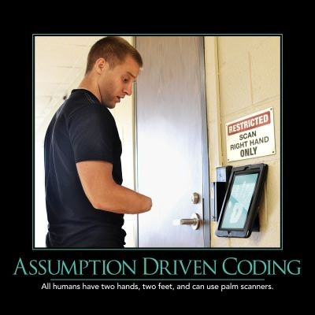

Assumption Driven Programming refers to the developer practice of assuming all users are like them. The best way to avoid falling into this trap is to interact with users as much as possible. It's certainly important to [dogfood](/practices/dogfooding) your software, but not at the expense of seeing how real customers use it.

Your application's users won't necessarily behave the way you would. Or the way you think they should. Provide easy ways for users to provide you with feedback. Leverage analytics tools to see the most common pathways users take through the application. Identify features that are underused and determine the cause. Are users not discovering the feature? Do they not understand how to use it? Does it even belong in this product?

For larger products, consider segmenting your users into different _personas_. Each persona represents a typical class or archetype of user of the system. Personas can be useful when making product design decisions. Who is going to use this? How will they find it? Will it get in the way of other users who won't use it?

As you collect feedback, ship updates often and be sure to communicate changes with your users. Don't stop there - listen to their feedback (again) regarding your latest updates. Continue to tweak and tune the application so it delights most of your users. Just be careful to avoid too much [feature creep](feature-creep/) as the product grows.

## Quotes

"You are not the user." - Anonymous

## See Also

[Feedback](/values/feedback/)
