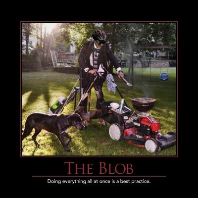

The Blob is an anti-pattern that describes a class which resembles the monster from the 1958 film [_The Blob_](http://www.imdb.com/title/tt0051418/?ref_=nv_sr_2), which absorbs anything it touches and grows larger and larger over time. Such classes are similar to God Objects and over time lose any focus they might once have had. Blob classes violate well-known OOP principles such as the [Single Responsibility Principle](/principles/single-responsibility-principle) and the [Open/Closed Principle](/principles/open-closed-principle), and tend to be more expensive to maintain and lead to [Big Ball of Mud](/antipatterns/big-ball-of-mud) systems.

Rather than allow a class to expand like The Blob, refactor using Extract Class and create smaller classes that each have a single responsibility.

## References

2014 Telerik Software Craftsmanship Anti-Patterns Wall Calendar

[SOLID Principles of Object Oriented Design (Pluralsight)](https://www.pluralsight.com/courses/principles-oo-design)
