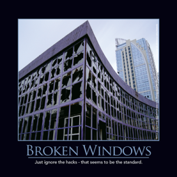

Small problems, left uncorrected, signal a lack of care about the state of things. Hence, discipline degrades and problems multiply. Combat code rot in your application by agreeing to and following coding conventions and standards, and by practicing the [Boy Scout Rule](/boy-scout-rule/) and making small improvements to the codebase with each new commit.

## References

[2016 Software Craftsmanship Calendar](http://amzn.to/1NI2m22)
