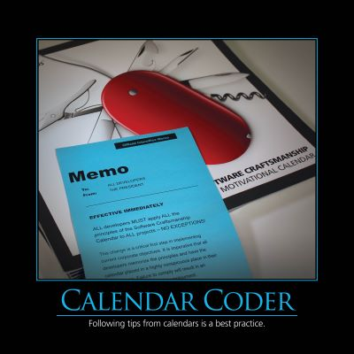

Featured in the 2012 Software Craftsmanship AntiPatterns calendar, the Calendar Coder antipattern is a play on the notion of cargo cult programming.  The problem in both cases is the lack of thought and understanding on the part of the developer who blindly follows advice from a source they consider worthwhile.  The preferred activity of course is to apply critical thought to all advice received, regardless of the source, and ensure that you understand why and how something should or should not be done.

## See Also

Cargo Cult Programming

## References

NimblePros AntiPatterns 2012 Wall Calendar
