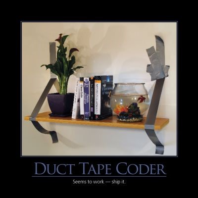

The Duct Tape Coder is someone who is able to cobble together software that solves the immediate problem, but without any concern for the code's quality or maintainability.  Sometimes, a bit of duct tape is exactly what the situation calls for, but other times a lack of attention to detail and basic code hygiene constitute professional negligence.  Sometimes duct tape programming is contrasted with the [straw man](http://en.wikipedia.org/wiki/Straw_man) of the "architecture astronaut" who spends endless amounts of time on design but never actually delivers any software.  It is important to remember that work in progress is one of the key components of waste identified in software development, so whether you are building software with duct tape or with proper tools, it's critical to ship working software early and often.

## See Also

[Respect](/values/respect)

## References

[The Duct Tape Programmer](http://www.joelonsoftware.com/items/2009/09/23.html)

[Debunking the Duct Tape Programmer](http://jeffreypalermo.com/blog/debunking-the-duct-tape-programmer/)

NimblePros AntiPatterns 2012 Wall Calendar
