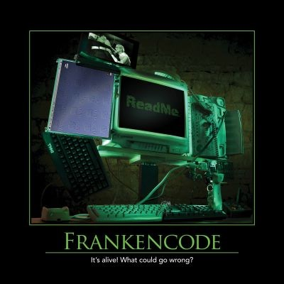

Frankencode refers to code that was never designed to work together, being pulled into a single application and held together with duct tape, baling wire, and maybe some Adapter design pattern usage. While software reuse and composability are desirable, frequently software that has been developed independently is written using incompatible assumptions and design decisions. Thus, when integrated together, the result can be clumsy and poorly architected, at least when compared to software that was designed to work together within the problem domain being considered.

## Quotes

"...learn from my miseries, and do not seek to increase your own." - Mary Shelley, _Frankenstein_
