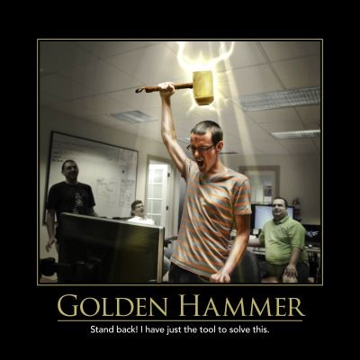
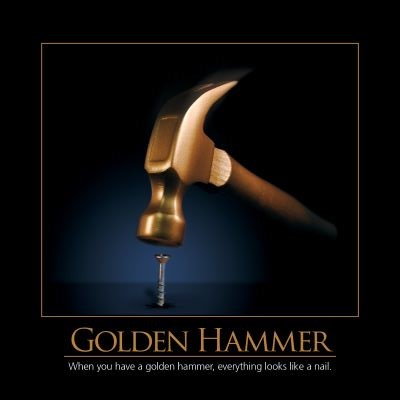

The Golden Hammer refers to a language, tool, or platform with which the developer is comfortable and productive, so they are tempted to use it for any problem that presents itself.  As the saying goes, "If all you have is a hammer, everything looks like a nail." ([Maslow's Instrument](http://en.wikipedia.org/wiki/Golden_hammer))  Sometimes the Golden Hammer is the database, and logic that would be better off in the application ends up in the database because someone is more comfortable with SQL than with the application language.  Sometimes the reverse is true, and database-centric logic ends up in the application.  Other times, the tool in question can be the choice of application platform, with an application being built as a web or desktop application because that's where the developer feel comfortable, rather than because it's the best solution to the needs of the client.  Many developers love new things, so sometimes they fall victim to the Shiny Toy antipattern, and in such cases it's not uncommon for them to treat their new Shiny Toy like a Golden Hammer, too. For example, when XML first became popular, developers tried to use it for everything, even many things for which it wasn't necessarily well-suited.

## See Also

[Shiny Toy](shiny-toy)

## References

2014 Telerik Software Craftsmanship Anti-Patterns Wall Calendar

NimblePros AntiPatterns 2012 Wall Calendar

[Principles, Patterns, and Practices of Mediocre Programming](https://ardalis.com/principles-patterns-and-practices-of-mediocre-programming/)
