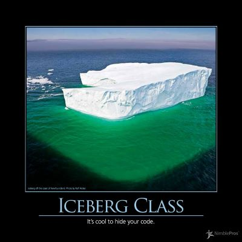

Although encapsulation is an oft-cited good thing to have in a design, there are many cases in which hiding an abundance of implementation behind private methods is undesirable.  Often, this behavior is beyond the actual scope of the class in which it currently resides, and could easily be refactored via Extract Class into another class in which much of this behavior could be exposed via public properties and methods. [Michael Feathers](http://www.artima.com/weblogs/index.jsp?blogger=mfeathers) coined the term [Iceberg Class](http://www.artima.com/weblogs/viewpost.jsp?thread=125574) in his article in August, 2005, in which he describes an example of such a class using Python.

It's important to remember as we design our classes that we use visibility modifiers like public, private, and protected in order to protect clients of our class from changes to our class.  That is, we encapsulate behavior that should be hidden from the client of our class, to avoid having it depend on the details of our implementation.  However, an equally viable way to abstract the details of how our class performs its actions is to have it depend on an interface, and write a class that implements this interface.  Then, if the behavior later needs to change, our class likely will not need to change at all, and perhaps the new behavior can be provided in the form of an entirely new class implementing the existing interface.  Classes written in this fashion tend to be less coupled, more cohesive, and follow the [Open-Closed Principle](/principles/open-closed-principle) and [Dependency Inversion Principle](/principles/dependency-inversion-principle).

## See Also

[Single Responsibility Principle](/principles/single-responsibility-principle)

[Open-Closed Principle](/principles/open-closed-principle)

[Dependency Inversion Principle](/principles/dependency-inversion-principle)

## References

[Iceberg Classes](http://www.artima.com/weblogs/viewpost.jsp?thread=125574), by Michael Feathers

NimblePros AntiPatterns 2012 Wall Calendar
