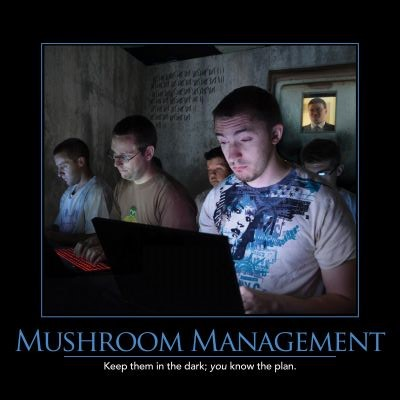

Mushroom Management refers to the practice of treating your developers like mushrooms - to wit, "keep them in the dark and feed them BS." By introducing barriers between those who develop the software and those who use it, feedback loops are extended (or destroyed) and the likelihood of mis-communication, invalid assumptions, and building the wrong thing skyrockets.

Ideally, the customer or their representative should be co-located with the developers, who themselves should be co-located. This minimizes the communication friction involved in the development process, which should be a shared effort between all members of the team (yes, the customer should be a part of the team, along with the developers, designers, testers, etc. involved).

At the business level, ensure your employees feel like they know what is going on with the organization. Share as much as you can, especially about big picture items like the mission, goal, vision, or strategy that everyone should currently be following. Thus, even if the details of the plan aren't yet ready, or an individual department's plan hasn't been formulated, individual employees can make good decisions in the best interests of the company's internally expressed intent. Without sharing this information, employees are each left to their own devices, which causes stress in the best case and results in inefficiencies and possibly conflict with management (when the wrong decision has been made due to lack of information) in worse cases.

## References

2014 Telerik Software Craftsmanship Anti-Patterns Wall Calendar
