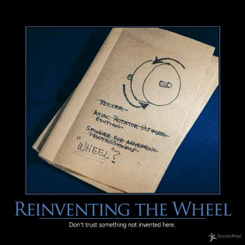

It's common for software developers and some organizations to prefer to write something they may need for a given project themselves, rather than using an available open source or commercial offering.  Generally, it's best to avoid this urge unless the feature or tool in question is a core part of the product being delivered.  For instance, unless your company is in the business of selling software logging and diagnostic tools, you do not need to write your own logging software.  Focus your efforts and energy on doing the one thing your product needs to do extremely well, and leverage existing software wherever you can outside of this area.

One exception to the general guidance to avoid reinventing the wheel is as a learning opportunity.  97 Things Every Programmer Should Know suggests that programmers reinvent the wheel often as a key method of educating themselves.  If you're learning a new language, framework, or technique, it's not a bad idea to build something well-known with it as a way to become familiar with how this new technology works.  Or, as [Jeff Atwood writes, Don't Reinvent the Wheel, unless You Want To Learn More About Wheels](http://www.codinghorror.com/blog/2009/02/dont-reinvent-the-wheel-unless-you-plan-on-learning-more-about-wheels.html).  But in these cases, qualify the time spent as education and personal growth time, not time you're spending on adding value to your current project.

## See Also

[Not Invented Here (NIH)](/antipatterns/not-invented-here)

## References

NimblePros AntiPatterns 2012 Wall Calendar
