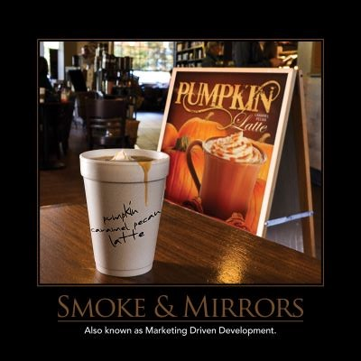

The practice of showing a customer "smoke and mirrors" and then hoping the engineers or developers can build it has been around for as long as sales and marketing people have had jobs.  As long as what's being sold can realistically be delivered, this practice works great and ensures there is continued demand for new and improved products and services.  However, when the customer is told to expect the world, and typically within an unrealistic timeframe, that's a recipe for disaster.  Strive to underpromise and overdeliver (a.k.a. Deliver more than expected) wherever possible, and work closely with customers to develop the product so they see it grow from idea to finished product and aren't surprised at any point to learn that the full-featured demo they thought they saw was really just a bunch of wireframes and animations with nothing behind them.

## Quotes

"Underpromise; overdeliver" - Tom Peters
