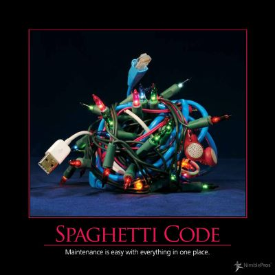

Featured in the 2012 Software Craftsmanship AntiPatterns calendar, Spaghetti Code refers to code that has a tangled, especially one in which following the actual flow of the program is difficult.

Different programming languages have different constructs that may lend themselves toward the creation of Spaghetti Code.  In older languages, the use of GOTO statements is the most glaring example, accounting for much of this statement's current infamy in the computer science profession.  In later languages, especially scripting languages, the use of include files or statements could often result in Spaghetti Code.  Likewise, languages that tended to mix business logic, data logic, application flow, and UI logic, like many ASP and PHP pages, can easily devolve into Spaghetti Code if proper discipline and coding habits are not maintained.

## See Also

[Duct Tape Coder](/antipatterns/duct-tape-coder) (often guilty of rapidly producing Spaghetti Code to get something done)

## References

NimblePros AntiPatterns 2012 Wall Calendar

Wikipedia - [Spaghetti Code](http://en.wikipedia.org/wiki/Spaghetti_code)
