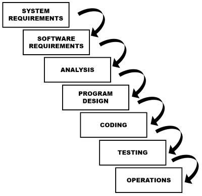

Waterfall, or Waterfail, is a rigid software development life cycle methodology that moves all activity through a series of stages, such as Gather Requirements, Design, Develop, Test, Deliver, Maintain.  The first article describing this model [(Managing the Development of Large Software Systems](http://www-scf.usc.edu/~csci201/lectures/Lecture11/royce1970.pdf)) was published in 1970 by Dr. Winston W. Royce, though the article didn't include the term 'waterfall.'  Ironically, though adoption of the model remains rampant throughout the software development industry, Royce presented the model as an example of what not to do - a model with significant flaws.

Developing software is a complex activity that involves a number of steps in order to complete.  The simplest programs written for internal use might simply involve the steps of identifying requirements and writing the code to achieve them.  However, for more complex and/or customer-facing systems, additional tasks must be included to account for deployment and design considerations, maintenance and quality assurance operations, etc.  When all of these are taken into account it is not uncommon for there to be half a dozen or more different tasks to be completed for a given piece of user-facing functionality to be delivered.  In the most naive approach, these various activities can be arranged sequentially, batched, and gated such that no work can begin on a new phase until all work as been completed for the previous phase.  This kind of Software Development Life Cycle is today considered an antipattern for a variety of reasons, and even in organizations that claim to build software in this fashion today, it is typical for some phases of activity to begin work ahead of schedule "under the radar" in the interests of improving productivity and product quality.

## Problems with Waterfall

There are several problems with the Waterfall approach to custom software development.  It may make sense to follow such a rigid approach when building a bridge, for example.  In the case of building a bridge, the general requirements are well understood, the processes and engineering efforts involved are well-known and typically have been used for decades if not centuries.  Changes to the design once actual building has begun (or after it has completed) are expensive enough to be considered impractical.  In such cases, ensuring the design is correct before moving forward with construction makes a great deal of sense.

However, even in the case of bridge building, it is not uncommon as part of the design process for models and prototypes to be constructed and presented to stakeholders for feedback.  Especially in the case of a new or challenging design for a bridge, multiple prototypes and physical models would no doubt be completed and analyzed prior to construction of the actual bridge.  These activities represent building and testing processes that take place prior to actual construction in order to gather feedback and increase domain knowledge about the problem being solved.

In the field of custom software development, virtually anything worth writing is new.  If a particular problem and its solutions are well-understood, then typically it can be accomplished through the use of commercial or open-source tools, frameworks, or services.  The hard problems, the ones worth solving by writing new software, are generally novel and require a fair bit of feedback and learning to solve effectively.  The best way to achieve rapid feedback and foster learning about the domain on the part of the development team is to rapidly iterate through solutions and designs.

In addition to learning and feedback, it is also important to consider iterative design from a batch size standpoint.  Lean methodologies have shown that reduction in batch size is a key mechanism for improving quality and increasing flow through a value stream.  If a particular system has 100 requirements, and all of these requirements must be fully documented before any of them can be analyzed, and likewise they must all be analyzed before the design can begin, and finally the design must be complete before coding commences, then this represents a batch size of 100.  If a particular assumption proves to be invalid and impacts several requirements, then all of the time spent on analysis and design for these requirements is wasted.  Further, by the time such requirements make it through the pipeline, a great deal of time will have passed from when they were gathered and defined, making it increasingly likely that they will be misremembered or will simply have changed before they have been implemented.  If instead the requirements are gathered and analyzed in small batches (say, 1 to 5 at a time), then the time required to design, code, and test these few requirements will be greatly reduced, and customers will see the total time between when they ask for something and when they receive it to be much smaller, and they will be better able to refine their expectations iteratively, rather than trying to cram everything they think they might need into an initial large batch of requirements.

## References

Waterfall Model on [Wikipedia](http://en.wikipedia.org/wiki/Waterfall_model)

NimblePros AntiPatterns 2012 Wall Calendar
