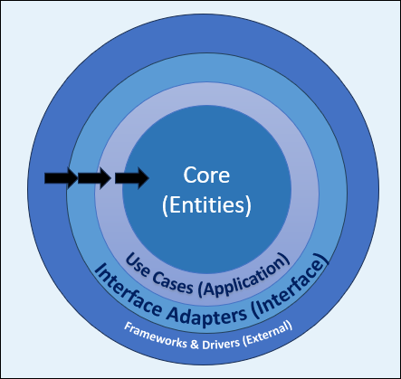

Clean Architecture is an attempt at aggregating some of the great features of other architectures into one idea. These are the architectures that it takes inspiration from:

- [Hexagonal Architecture](https://alistair.cockburn.us/hexagonal-architecture/) - Ports & Adapters from Alistair Cockburn
- [Onion Architecture](https://jeffreypalermo.com/2008/07/the-onion-architecture-part-1/) - from Jeffrey Palermo
- [Data, Context, and Interaction (DCI)](https://fulloo.info/Documents/ArtimaDCI.html) from James Coplien and Trygve Reenskaug
- [Boundary Control Entity (BCE)](https://www.amazon.com/Object-Oriented-Software-Engineering-Approach/dp/0201544350) from Ivar Jacobsend

## Guiding Principles

The key to these architectural approaches is [separation of concerns](/principles/separation-of-concerns). There are layers for use cases, business rules, and other key concepts. Each of those layers - except the business rules - has a dependency on an inner layer.

There are four guiding principles for Clean Architecture:

- [Separation of Concerns](/principles/separation-of-concerns)
- [Single Responsibility Principle](/principles/single-responsibility-principle)
- [Dependency Inversion Principle](/principles/dependency-inversion-principle)
- [Explicit Dependencies Principle](/principles/explicit-dependencies-principle)

## How It Works

This is the basic layout of Clean Architecture, as demonstrated with concentric circles.

- Entities depend on nothing and are at the Core.
- Use Cases depend on Entities.
- Interface Adapters depend on Use Cases.
- Frameworks & Drivers depend on Interface Adapters and include components like UI, Web, APIs, Databases, and External Services.

This structure illustrates the direction of dependencies, emphasizing that inner layers do not depend on outer layers, which is a key principle of Clean Architecture.

One of the key reasons to use Clean Architecture is that it separates the business logic from the technical decisions. These layers support that statement.

## Benefits

These are some of the benefits of Clean Architecture:

- **Separation of Concerns**: Each layer has a distinct responsibility, making the codebase easier to manage and understand.
- **Testability**: Core business logic is isolated from external dependencies, enabling easier and more reliable unit testing.
- **Maintainability**: Clear boundaries and dependencies reduce the risk of changes in one part of the system affecting others, leading to easier maintenance.
- **Scalability**: The architecture supports the addition of new features or technologies without requiring significant changes to the core business logic.
- **Flexibility**: External components like databases, UI, or frameworks can be swapped or upgraded with minimal impact on the core application logic.

## Drawbacks

These are some of the drawbacks of Clean Architecture:

- **Complexity**: The structure can introduce additional layers and abstractions, which might be overkill for small or simple projects.
- **Initial Overhead**: Setting up and maintaining the architecture requires more upfront effort and discipline.
- **Steep Learning Curve**: Developers unfamiliar with the concepts may find it challenging to understand and implement correctly.
- **Potential Over-Engineering**: Overemphasizing Clean Architecture can lead to unnecessary complexity, especially in projects that don't require such a robust structure.
- **Slower Development**: The separation of concerns and strict adherence to principles may slow down initial development, especially in the early stages.

## Learn More

- [NimblePros Academy: Clean Architecture course](https://bit.ly/3WHdwfC)
- [Clean Architecture with .NET 8 webinar](https://mailchi.mp/nimblepros/clean-architecture-dotnet-8-recording)