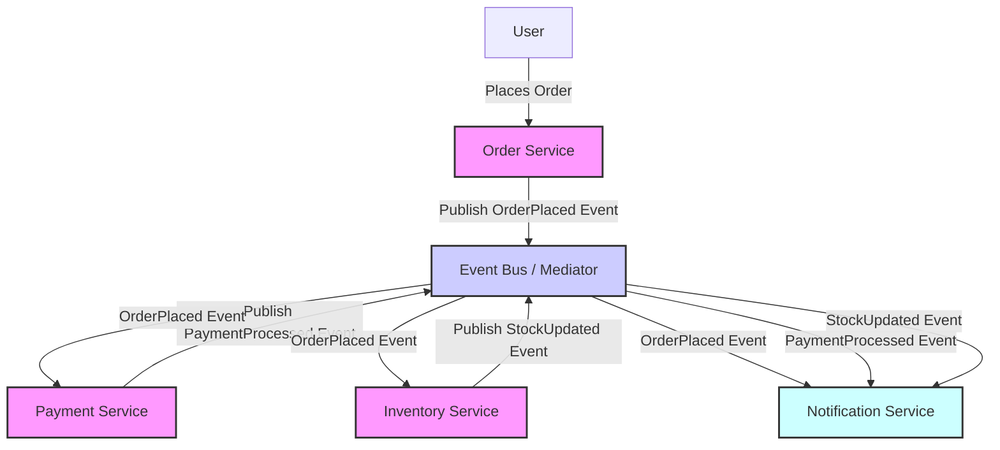

Event-Driven Architecture (EDA) is a software architecture pattern where the flow of the program is determined by events—discrete changes in state. 

The concept of reacting to events is not new, but the term "Event-Driven Architecture" started gaining traction in the late 1990s and early 2000s. It was popularized as systems became more distributed and required more real-time processing. Although it’s hard to pinpoint a single person who coined the term, it gained prominence through the works of various thought leaders in software architecture, especially in the context of service-oriented architecture (SOA) and messaging systems.

## Key Characteristics

These are some of the key characteristics seen in Event-Driven Architecture.

- **Events as Triggers**: Components or services react to events instead of being directly invoked by other components.
- **Loose Coupling**: Components are loosely coupled, meaning they do not need to know about each other directly. This is achieved through events that are published and consumed independently.
- **Asynchronous Communication**: EDA often relies on asynchronous messaging, allowing systems to be more resilient and scalable.
- **Real-Time Processing**: EDA is well-suited for scenarios that require real-time data processing and responsiveness.

## Common Uses of Event-Driven Architecture

EDA is particularly useful in scenarios where systems need to respond quickly to changes, often in real-time. Common use cases include:

- **Financial Services**: Trading platforms where quick responses to market changes are crucial.
- **eCommerce**: Managing inventory, orders, and customer notifications in real-time.
- **IoT (Internet of Things)**: Devices that need to respond to changes in environment or user actions.
- **Microservices Architecture**: Decoupling services by allowing them to communicate through events rather than direct calls.

## How It Works

Let's look at this architecture in terms of eCommerce.

**User Interaction**: The user places an order, triggering the Order Service.
**Order Service**: Upon receiving a new order, the Order Service publishes an `OrderPlaced` event to the Event Bus.
**Event Bus**: Acts as the central mediator that receives and routes events to the appropriate consumers.
**Event Consumers**:
- **Payment Service**: Listens for `OrderPlaced` events to initiate payment processing. Upon successful payment, it publishes a `PaymentProcessed` event.
- **Inventory Service**: Listens for `OrderPlaced` events to update inventory stock levels.
- **Notification Service**: Listens for both `OrderPlaced` and `PaymentProcessed` events to notify the user about order confirmation and payment status. It also listens for `StockUpdated` events to notify users if an item is back in stock.

Here is the flowchart for the process:

## Key Terms

These are some key terms used with EDA:

- **Event Producers**: `Order Service`, `Payment Service`, and `Inventory Service` act as event producers, generating events based on business operations.
- **Event Bus**: The Event Bus routes events to the relevant consumers, ensuring that all necessary actions are triggered by a single event.
- **Event Consumers**: The `Payment Service`, `Inventory Service`, and `Notification Service` act as consumers, listening to events that pertain to their responsibilities.
- **Loose Coupling**: Producers and consumers are decoupled, which means they don't need direct knowledge of each other. This allows for easier scaling and maintenance.
- **Scalability**: New services (e.g., shipping or analytics services) can be added as consumers without changing existing services.

## Benefits of Event-Driven Architecture

These are some of the benefits of EDA:

- **Scalability**: EDA allows systems to handle high volumes of events and traffic by adding more consumers or producers without changing the existing infrastructure.
- **Loose Coupling**: Components interact through events rather than direct calls, which reduces dependencies and makes the system more flexible and maintainable.
- **Real-Time Processing**: EDA enables real-time responses to events, making it ideal for applications that require immediate feedback and action, such as monitoring, analytics, and notifications.
- **Resilience**: EDA can improve system resilience by isolating failures to individual components, allowing other parts of the system to continue functioning even if some components fail.
- **Asynchronous Communication**: EDA supports asynchronous communication, which helps optimize system resources, improve performance, and avoid bottlenecks caused by synchronous processing.

## Drawbacks of Event-Driven Architecture

These are some of the drawbacks of EDA:

- **Complexity**: EDA can introduce architectural complexity, making it harder to design, implement, and maintain the system compared to traditional synchronous approaches.
- **Debugging and Monitoring**: Troubleshooting can be challenging due to the asynchronous nature of events, making it harder to trace the flow of data and identify the source of issues.
- **Data Consistency**: Maintaining consistency across distributed systems and services can be difficult, especially when events are processed out of order or lost.
- **Latency**: Although EDA supports real-time processing, the asynchronous nature may introduce latency between event production and consumption, affecting performance for time-sensitive operations.
- **Resource Overhead**: The infrastructure required to manage event routing, storage, and processing (e.g., event buses, brokers, and message queues) can add resource overhead and increase operational costs.

## Additional References

- [Mediator pattern](/design-patterns/mediator-pattern)