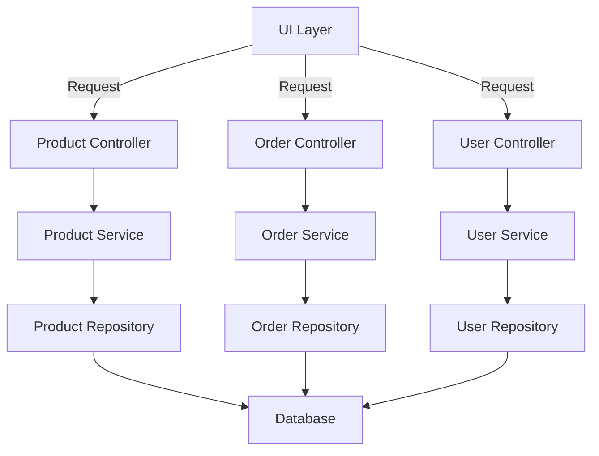

---
title:"Vertical Slice Architecture"
date: "2024-06-28"
description: "In Vertical Slice Architecture, we organize the application by features rather than layers."
featuredImage: "./images/vertical-slice-architecture.png"
---

In Vertical Slice Architecture, we organize the application by features rather than layers. Each feature is encapsulated in its own "slice," containing all the necessary components from the presentation layer down to the data access layer.

The following diagram could be an approach for an eCommerce website. Notice that there are vertical slices for products, orders, and users.

## What Problems It Solves

These are some of the problems solved by Vertical Slice Architecture.

### Complexity and Coupling

Traditional architectures often result in tightly coupled layers where changes in one layer can ripple through others, making the system complex and hard to maintain. Vertical Slice Architecture isolates features, reducing coupling between different parts of the application.

### Feature Ownership

In traditional layered architectures, a single feature's code is often spread across multiple layers (e.g., UI, business logic, data access), leading to difficulties in understanding and maintaining the feature. Vertical Slice Architecture promotes feature-based decomposition, making it easier to understand and manage each feature independently.

### Scalability of Teams

When teams grow, it becomes challenging to manage code changes in a shared codebase. Vertical Slice Architecture allows teams to work on different features independently without stepping on each other’s toes, facilitating better collaboration and parallel development.

### Testability

Testing in layered architectures can be cumbersome because tests often require setting up and interacting with multiple layers. Vertical Slice Architecture simplifies testing by encapsulating all necessary components for a feature within a single slice, making it easier to write and maintain tests.

### Deployment and Maintenance

With a traditional monolith, deploying a small change often requires redeploying the entire application, increasing the risk of downtime and failures. Vertical Slice Architecture can lead to more modular and independent deployment strategies, reducing the impact of changes and making maintenance more manageable.

### Incremental Refactoring

For legacy systems, refactoring can be risky and disruptive. Vertical Slice Architecture allows incremental refactoring by migrating features one slice at a time, reducing the risk and allowing for gradual improvement.

## Prerequisites

When implementing this architecture, teams should have the following understanding:

- [Code smells](/antipatterns/code-smells) - know what antipatterns to avoid and watch out for in business logic
- [Refactoring](/practices/refactoring) - know how to refactor and get away from the code smells

## References

- [Technology & Friends: Jimmy Bogard on Vertical Slice Architecture and MediatR](https://youtu.be/k4UP08SZoHc?si=f141E7Qpu5_-Y7x8)
- [Vertical Slice Architecture - Jimmy Bogard's website](https://www.jimmybogard.com/vertical-slice-architecture/)
- [Vertical Slice Architecture - Jimmy Bogard - NDC Conferences](https://www.youtube.com/watch?v=SUiWfhAhgQw)
- [Contoso University for .NET Core with Vertical Slices](https://github.com/jbogard/ContosoUniversityDotNetCore)