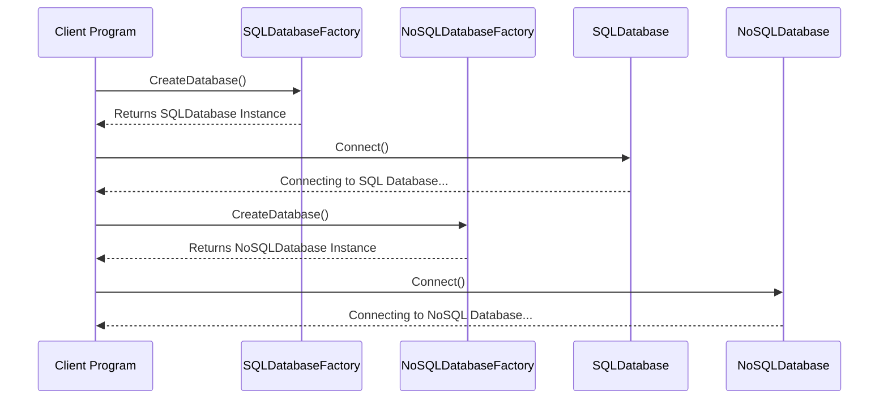

## What is the Abstract Factory Pattern?

The Abstract Factory Pattern provides an interface for creating families of related or dependent objects without specifying their concrete types. This pattern allows the client to use abstract classes instead of concrete classes to create families of objects.

## When to Use It

1. **System Independence**: When you want the system to be independent of how its objects are created, composed, and represented.
2. **Interchangeable Families of Products**: When a family of products is intended to be used together, and you need to enforce this constraint.
3. **Isolation of Concrete Classes**: When you want to provide a library of products and reveal only their interfaces, not their implementations.

## C# Example

```csharp
// Abstract Product
public interface IDatabase
{
    void Connect();
}

// Concrete Products
public class SQLDatabase : IDatabase
{
    public void Connect() => Console.WriteLine("Connecting to SQL Database...");
}

public class NoSQLDatabase : IDatabase
{
    public void Connect() => Console.WriteLine("Connecting to NoSQL Database...");
}

// Abstract Factory
public interface IDatabaseFactory
{
    IDatabase CreateDatabase();
}

// Concrete Factories
public class SQLDatabaseFactory : IDatabaseFactory
{
    public IDatabase CreateDatabase() => new SQLDatabase();
}

public class NoSQLDatabaseFactory : IDatabaseFactory
{
    public IDatabase CreateDatabase() => new NoSQLDatabase();
}

// Client
class Program
{
    static void Main(string[] args)
    {
        IDatabaseFactory factory = new SQLDatabaseFactory();
        IDatabase sqlDatabase = factory.CreateDatabase();
        sqlDatabase.Connect();
    }
}
```



Here's what the sequence represents:

- The Client Program asks the SQLDatabaseFactory to CreateDatabase().
- SQLDatabaseFactory returns an instance of SQLDatabase.
- The Client Program then calls Connect() on the SQLDatabase instance.
- SQLDatabase responds to indicate that it's "Connecting to SQL Database...".

This sequence is repeated for the NoSQL database for demonstration (not shown in the code).

## Advantages

- **Consistency**: Ensures that the objects you're using belong to the same family of products, thereby improving consistency.
- **Loose Coupling**: Helps in reducing the coupling between the client code and concrete classes.
- **Ease of Extensibility**: Makes it easier to add new types of products into the system.

## What about DI/IOC Containers

Both the Abstract Factory Pattern and Dependency Injection (DI) are used to manage dependencies in a software application, but they achieve this goal in different ways and are suited to different scenarios.

Here's how they relate:

- **Decoupling**: Both aim to reduce the coupling between classes or modules. In the case of the Abstract Factory, this is done by providing an interface for creating families of objects. DI achieves this by injecting the dependencies instead of letting a class create its own dependencies.

- **Code Maintainability**: Both techniques improve code maintainability by isolating the construction code. This makes it easier to manage changes in the future.

- **Object Creation**: Abstract factories often use DI to inject various dependencies into the objects they create, making DI a complementary technique rather than an alternative.

- **Configuration**: In a typical Inversion of Control (IoC) container with Dependency Injection, you configure how dependencies are resolved. Similarly, in an abstract factory, you would configure which factory to use, although this is often done manually.

### Differences between Abstract Factory and DI Containers

- **Scope**: DI containers usually operate application-wide, whereas an Abstract Factory could be scoped more narrowly to specific parts of the application.

- **Flexibility**: DI containers are generally more flexible and can manage more complex scenarios, such as lifetime management of objects, lazy instantiation, etc. Abstract factories are best suited for scenarios where you need to enforce that objects are created in families.

- **Automated vs Manual**: IoC containers often take care of the whole object graph, constructing an entire hierarchy of objects as needed. Abstract factories typically need to be manually invoked to create objects.

- **Complexity**: Using an IoC container usually requires an additional dependency and may require a learning curve, while an Abstract Factory can often be implemented with plain old C# code and no additional libraries.

## Conclusion

The Abstract Factory Pattern provides an efficient way to manage and create families of related products. It enables loose coupling and high cohesion, making the code more maintainable and extensible. It is a crucial pattern for large systems and libraries that aim to maintain consistency and modularity.

## References

Amazon - [Design Patterns: Elements of Reusable Object-Oriented Software](http://amzn.to/vep3BT) - Gang of Four

[Pluralsight - Design Patterns Library](http://bit.ly/DesignPatternsLibrary)
