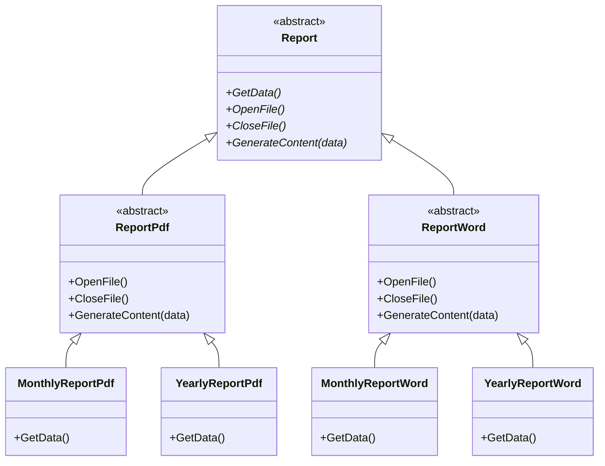
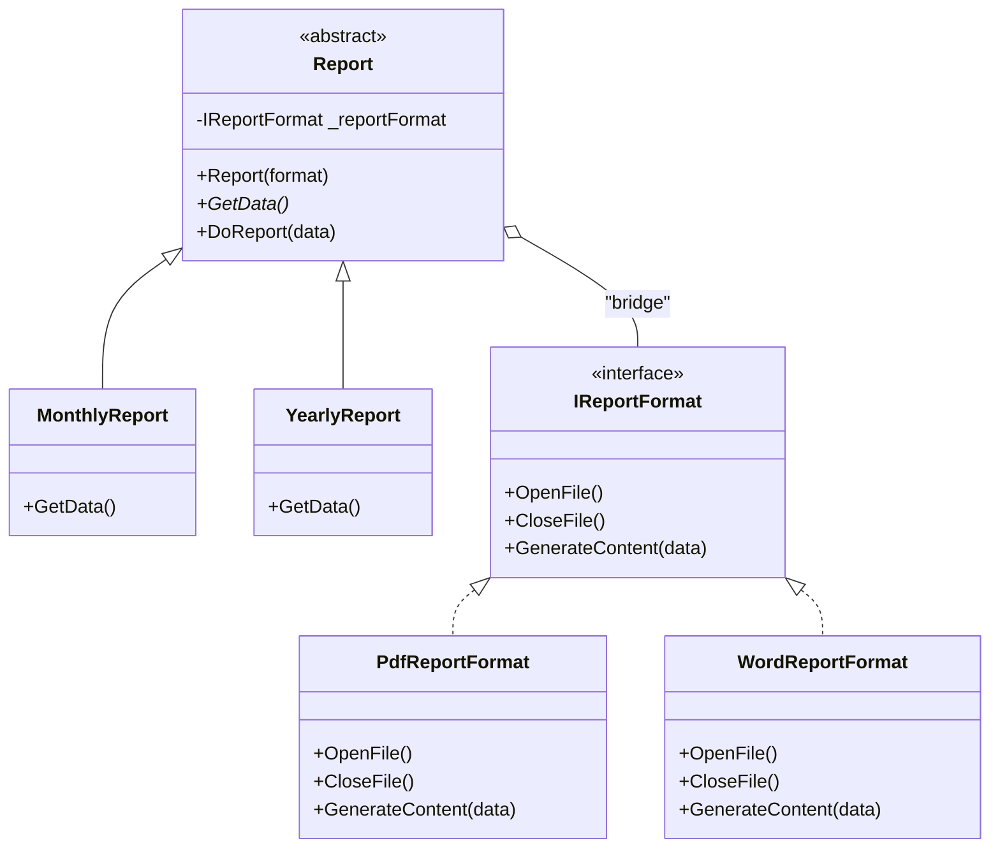

The Bridge pattern is a structural design pattern, it can be used in situations where two types of hierarchies must remain independent, yet still interact cleanly through a well‑defined connection (the "bridge"). In this pattern, one hierarchy is called the *"abstraction"* and the other - the *"implementor"*. If both are forced into a single inheritance tree, it usually results in a subclass explosion, since each hierarchy can evolve. The Bridge pattern decouples abstraction from it's implementation and avoids subclass explosion.

## C# Example

To explain the pattern effectively, it's best to demonstrate how the problem emerges step by step across several iterations of code.

### Iteration #1 - Simple Structure

Suppose we need to provide a basic implementation for two kinds of reports that must currently be generated in PDF format. To avoid duplicating shared behavior, we introduce an abstract base class that encapsulates the common logic. The *GetData()* method remains abstract because the data required for each report is specific to that report type:
```csharp
public abstract class ReportPdf
{
    public abstract string GetData();

    public void OpenFile() => Console.WriteLine("Opening PDF file");
    public void CloseFile() => Console.WriteLine("Closing PDF file");
    public void GenerateContent(string data)
        => Console.WriteLine("Generating PDF report from input data");
}

public class MonthlyReportPdf : ReportPdf
{
    public override string GetData()
    {
        Console.WriteLine("Getting monthly report data");
        return "The monthly report data";
    }
}

public class YearlyReportPdf : ReportPdf
{
    public override string GetData()
    {
        Console.WriteLine("Getting yearly report data");
        return "The yearly report data";
    }
}
```
At this point we have a single inheritance structure and currently there is no reason to think about splitting it and introducing additional complexity in code. The design is simple and the abstraction works well enough for the current scope.

### Iteration #2 - Extended Model

Now we need to support another report format - a Word report. A reasonable next step is to introduce a more generic abstract class - *Report*, and derive specific report types from it. This allows us to share common behavior while keeping the report‑specific logic in the subclasses:
```csharp
public abstract class Report
{
    public abstract string GetData();
    public abstract void OpenFile();
    public abstract void CloseFile();
    public abstract void GenerateContent(string data);
}

public abstract class ReportPdf : Report
{
    public override void OpenFile() => Console.WriteLine("Opening PDF file");
    public override void CloseFile() => Console.WriteLine("Closing PDF file");
    public override void GenerateContent(string data)
        =>  Console.WriteLine("Generating PDF report from input data");
}

public abstract class ReportWord : Report
{
    public override void OpenFile() => Console.WriteLine("Opening Word file");
    public override void CloseFile() => Console.WriteLine("Closing Word file");
    public override void GenerateContent(string data)
        => Console.WriteLine("Generating Word report from input data");
}

public class MonthlyReportPdf : ReportPdf
{
    public override string GetData()
    {
        Console.WriteLine("Getting monthly report data");
        return "The monthly report data";
    }
}

public class YearlyReportPdf : ReportPdf
{
    public override string GetData()
    {
        Console.WriteLine("Getting yearly report data");
        return "The yearly report data";
    }
}

public class MonthlyReportWord : ReportWord
{
    public override string GetData()
    {
        Console.WriteLine("Getting monthly report data");
        return "The monthly report data";
    }
}

public class YearlyReportWord : ReportWord
{
    public override string GetData()
    {
        Console.WriteLine("Getting yearly report data");
        return "The yearly report data";
    }
}
```


We still have a single inheritance structure, but it's already becoming clear that it mixes two different kinds of variations: the type of report and the type of report format. These two dimensions can evolve independently - for example, in future we may need to introduce another report type (*WeeklyReport*) and another type of format (CSV). This will quickly lead to a subclass explosion as the number of combinations grows.

### Iteration #3 - Extending the Model Further - the Problem

The problem of current implementation is the subclass explosion. If we need to extend the model to support a *WeeklyReport* - we must add two new concrete classes: *WeeklyReportPdf* and *WeeklyReportWord*. Likewise, if we want to support a CSV format, we must introduce a new abstract class *ReportCsv* and then implement two classes: *YearlyReportCsv* and *MonthlyReportCsv*. The larger the inheritance structure becomes, the more classes we must create whenever the model is extended. And as mentioned earlier, the reason for that is the mix of two dimensions in a single inheritance structure.

### Iteration #4 - Refactoring by Applying the Bridge Pattern

The first step when implementing the bridge pattern is to recognize those two separate hierarchies and define the appropriate abstract classes and interfaces that allow them to be separated. The bridge itself is the mechanism that connects these hierarchies. In our example, the report represents the *abstraction*, while the report format is an implementation detail — the *implementor*. To refactor our design into the Bridge pattern, we must shift from inheritance to composition (the well‑known "composition over inheritance" principle). The *Report* class now holds a protected field of type *IReportFormat*, which serves as the bridge between the two inheritance structures:
```csharp
public interface IReportFormat
{
    void OpenFile();
    void CloseFile();
    void GenerateContent(string data);
}

public class PdfReportFormat : IReportFormat
{
    public void OpenFile() => Console.WriteLine("Opening PDF file");
    public void CloseFile() => Console.WriteLine("Closing PDF file");
    public void GenerateContent(string data)
        => Console.WriteLine("Generating PDF report from input data");
}

public class WordReportFormat : IReportFormat
{
    public void OpenFile() => Console.WriteLine("Opening Word file");
    public void CloseFile() => Console.WriteLine("Closing Word file");
    public void GenerateContent(string data)
        => Console.WriteLine("Generating Word report from input data");
}


public abstract class Report
{
    protected IReportFormat _reportFormat;  // bridge
    // _reportFormat is the only way for a Report to interact
    // with ReportFormat-specific behaviour
    public Report(IReportFormat reportFormat)
    {
        _reportFormat = reportFormat;
    }

    public abstract string GetData();

    public void DoReport(string data)
    {
        _reportFormat.OpenFile();
        _reportFormat.GenerateContent(data);
        _reportFormat.CloseFile();
    }
}

public class MonthlyReport : Report
{
    public MonthlyReport(IReportFormat reportFormat) : base(reportFormat)
    {
    }

    public override string GetData()
    {
        Console.WriteLine("Getting monthly report data");
        return "The monthly report data";
    }
}

public class YearlyReport : Report
{
    public YearlyReport(IReportFormat reportFormat) : base(reportFormat)
    {
    }

    public override string GetData()
    {
        Console.WriteLine("Getting yearly report data");
        return "The yearly report data";
    }
}

class Program
{
    static void Main(string[] args)
    {
        var report = new YearlyReport(new PdfReportFormat());
        string data = report.GetData();
        report.DoReport(data);
    }
}
```


The advantage of this implementation is that if we need to add a new type of report (*WeeklyReport*) - we only need to add that single class.  It automatically supports all existing report formats because the design is now based on composition rather than inheritance. This way we avoided the subclass explosion.

## Managing the Abstraction-Implementor Relationship

Notice that *IReportFormat* field is declared as *protected* inside the *Report* class. This makes it accessible to all subclasses of *Report*. As a result, the report hierarchy can grow vertically - new report types can introduce additional behavior, and new methods can interact directly with the *IReportFormat* (*implementor*) through this protected field whenever needed. This preserves flexibility while keeping the two hierarchies cleanly separated.

Another option is to make this field *private*. However, doing so imposes a significant restriction on the entire model: all interaction with *IReportFormat* would have to occur exclusively through the abstract *Report* class. This means the report hierarchy could grow horizontally, meaning different implementations of *Report* may override the same set of methods in a different manner. Vertical growth becomes limited, since newly added methods are unable to directly access *IReportFormat*.

What matters most is that the *implementor* hierarchy must remain stable in both cases (whether the field is protected or private). Extending the *abstraction* should never force the *implementor* to grow or change to accommodate new abstraction-level needs. If it does, the independence of the two hierarchies is broken, and the Bridge pattern collapses.

## When to Use it
- **Avoiding Class Explosion**: When extending both abstraction and implementation hierarchies would otherwise lead to a large number of subclasses.

- **Separating Abstraction from Implementation**: When you want to decouple high‑level abstractions from their low‑level implementations so they can evolve independently.

- **Supporting Multiple Dimensions of Variation**: When a system must support different types of abstractions (e.g., reports) and different implementations (e.g., formats), without intertwining them.

- **Preserving Stability of Implementors**: When *implementor* classes should remain stable and unaffected by new abstraction‑level requirements.

Also, as this example shows, the need for the Bridge pattern becomes more apparent as the inheritance structure grows. It's usually better to apply it when the model begins to suffer from subclass explosion, rather than trying to force it in from the very beginning.

## References

Amazon - [Design Patterns: Elements of Reusable Object-Oriented Software](http://amzn.to/vep3BT) - Gang of Four

[Pluralsight - Design Patterns Library](http://bit.ly/DesignPatternsLibrary)