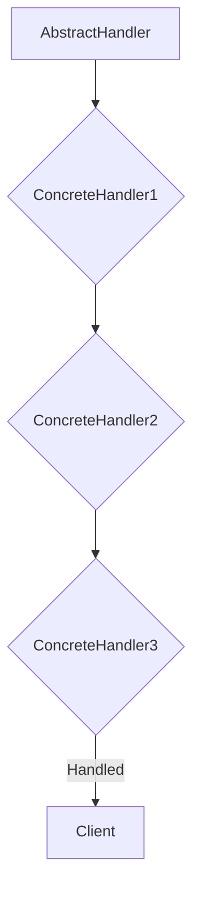
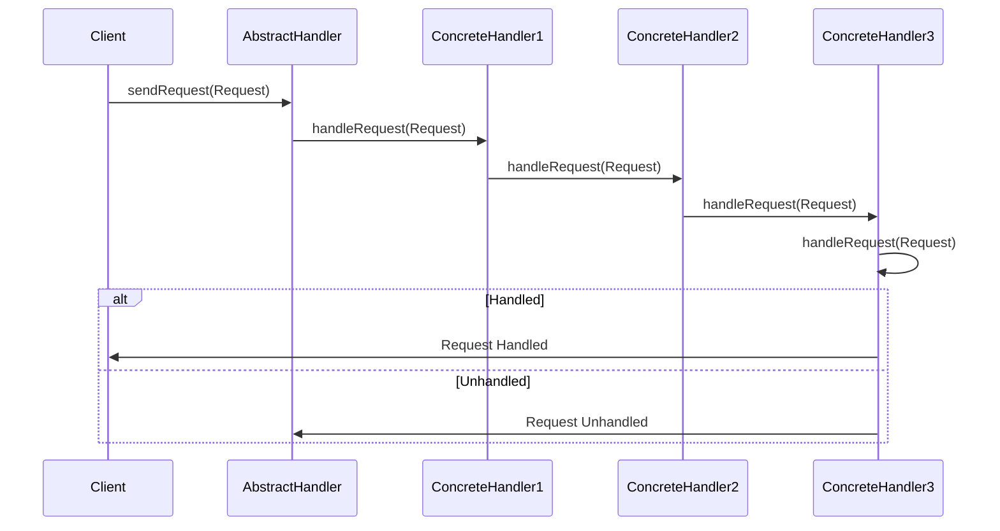

The Chain of Responsibility pattern is a behavioral design pattern that allows you to pass requests along a chain of handlers. Upon receiving a request, each handler decides either to process the request or to pass it to the next handler in the chain.

## Key Components of the Chain of Responsibility Pattern

The Chain of Responsibility Pattern has three components - a request, an abstract handler, and a handler.

The **request** contains the information to be processed by the chain of handlers. This is passed through the chain until it is handled or reaches the end of the chain.

An **abstract handler** typically includes 2 methods - one to set the next handler in the chain and one to process the requests.

A **handler** is a specific implementation of the abstract handler. It can handle a specific type of request or pass it on to the chain to be processed by a different handler.

This is a common flow:

The workflow for the chain of responsibility could also be represented like this:

## Benefits of the Chain of Responsibility Pattern

These are some of the benefits for using Chain of Responsibility Pattern:

- **Decoupling**: The sender of a request is not aware of the specific handlers that will process it, making the code more flexible and adaptable to changes in requirements.

- **Reusability**: Handlers can be reused in different chains of responsibility, promoting code reuse and reducing duplication.

- **Dynamic handling**: Requests can be handled differently based on the runtime context, allowing for flexible and adaptable processing logic.

- **Error handling**: Requests can be passed to different handlers for error handling, providing a centralized mechanism for handling errors and exceptions.

## Applications of the Chain of Responsibility Pattern

These are some common uses for the Chain of Responsibility pattern.

- **Authentication**: Authentication handlers can use the Chain of Responsibility pattern to allow different types of credentials to be accepted. An example of this is [the ChainedTokenCredential in .NET](https://learn.microsoft.com/en-us/dotnet/api/azure.identity.chainedtokencredential?view=azure-dotnet).
- **Event Handling**: A chain of event handlers can be used to respond to different types of domain events. This is a practice that can be seen in Domain-Driven Design.
- **Workflow**: A chain of workflow steps can be used to execute tasks of an automated business process in a particular sequence.
- **Authorization**: A chain of authorization handlers can be used to check whether a user has permissions to a process. This can be used for granular access control policies.

## References

- [Use the Decorator, Mediator, and Chain of Responsibility Patterns in C#](https://www.youtube.com/watch?v=eSQHpfaYspw)