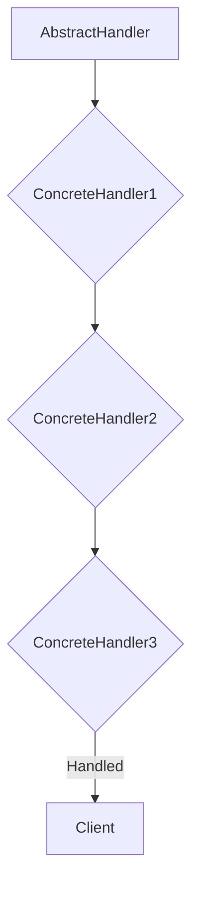
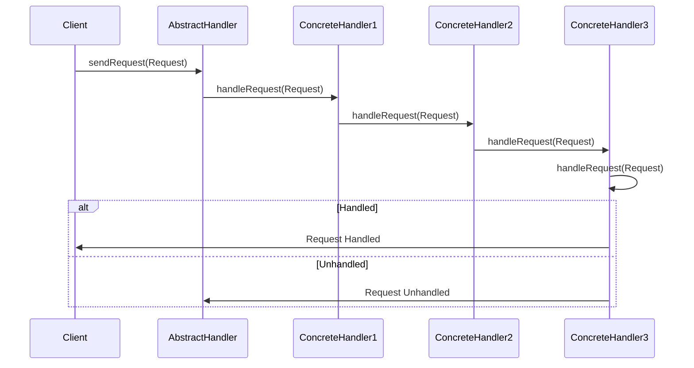

The Chain of Responsibility pattern is a behavioral design pattern that allows you to pass requests along a chain of handlers. Upon receiving a request, each handler decides either to process the request or to pass it to the next handler in the chain.

## Key Components of the Chain of Responsibility Pattern

The Chain of Responsibility Pattern has three components - a request, an abstract handler, and a handler.

The **request** contains the information to be processed by the chain of handlers. This is passed through the chain until it is handled or reaches the end of the chain.

An **abstract handler** typically includes 2 methods - one to set the next handler in the chain and one to process the requests.

A **handler** is a specific implementation of the abstract handler. It can handle a specific type of request or pass it on to the chain to be processed by a different handler.

This is a common flow:



The workflow for the chain of responsibility could also be represented like this:



## Benefits of the Chain of Responsibility Pattern

These are some of the benefits for using Chain of Responsibility Pattern:

- **Decoupling**: The sender of a request is not aware of the specific handlers that will process it, making the code more flexible and adaptable to changes in requirements.

- **Reusability**: Handlers can be reused in different chains of responsibility, promoting code reuse and reducing duplication.

- **Dynamic handling**: Requests can be handled differently based on the runtime context, allowing for flexible and adaptable processing logic.

- **Error handling**: Requests can be passed to different handlers for error handling, providing a centralized mechanism for handling errors and exceptions.

## Applications of the Chain of Responsibility Pattern

These are some common uses for the Chain of Responsibility pattern. Many of these uses are cross-cutting concerns that impact multiple modules or components within an application.

- **Authentication**: Authentication handlers can use the Chain of Responsibility pattern to allow different types of credentials to be accepted. 
- **Event Handling**: A chain of event handlers can be used to respond to different types of domain events. This is a practice that can be seen in Domain-Driven Design.
- **Workflow**: A chain of workflow steps can be used to execute tasks of an automated business process in a particular sequence.
- **Authorization**: A chain of authorization handlers can be used to check whether a user has permissions to a process. This can be used for granular access control policies.

## Chain of Responsibility with regards to Cross-Cutting Concerns

The Chain of Responsibility pattern can be used to handle cross-cutting concerns in software development. Cross-cutting concerns are aspects of a program that affect multiple modules or components and are not easily encapsulated within any single module or component. Examples of cross-cutting concerns include logging, authentication, authorization, caching, and transaction management.

The Chain of Responsibility pattern provides a mechanism to decouple cross-cutting concerns from the core business logic and handle them in a centralized and organized manner. Here's a general approach to implementing cross-cutting concerns using the Chain of Responsibility pattern:

1. **Define abstractions.** Create abstract classes or interfaces for handlers and requests. The handler interface should define a method for handling requests and the ability to set a next handler in the chain. The request interface should represent the data being passed along the chain.

2. **Create concrete handlers.** Implement concrete handler classes that handle specific cross-cutting concerns. Each handler should implement the handler interface and provide the logic for handling its respective concern.

3. **Chain handlers.** Assemble a chain of handlers by setting the next handler in each handler's constructor. The order of handlers in the chain determines the order in which requests are processed.

4. **Initiate a request.** Send the request to the first handler in the chain. Each handler has the opportunity to process the request, pass it to the next handler, or modify the request before passing it on.

5. **Handle the request or pass the request to the next handler.** Handlers determine whether to handle the request themselves or pass it on to the next handler. If a handler successfully handles the request, the chain terminates. Otherwise, the request is passed along the chain until it reaches the end or is handled by another handler.

## Chain of Responsibility Pattern in .NET

There have been questions on where you can see the Chain of Responsibility in .NET.
We're going to cover 3 cases - ASP.NET Core middleware, MediatR and its pipelines, and ChainedTokenCredential.

### ASP.NET Core Middleware

The ASP.NET Core middleware layer is made up of many handlers to process requests. The handlers that are loaded in the middleware layer are configured in `Program.cs`. The order they are added in the Program file is the order that a request is handled. This is how the chain of responsibility is built.

There is a defined order for some of the middleware, seen [in this document on the middleware fundamentals for ASP.NET Core](https://learn.microsoft.com/en-us/aspnet/core/fundamentals/middleware/?view=aspnetcore-8.0#middleware-order).

### Mediatr and Pipeline Behaviors

MediatR implements the Chain of Responsibility pattern through its use of pipelines. Pipelines are a set of behaviors that are executed before and after a request is handled by its corresponding handler. Each behavior in the pipeline has the opportunity to intercept the request, modify it, or even prevent it from reaching the handler.

When a request is sent to MediatR, it is first passed through the pipeline for the specific request type. Each behavior in the pipeline has the opportunity to intercept the request and perform its desired actions. If a behavior decides to handle the request, it can return a response, and the pipeline terminates. Otherwise, the behavior can call HandleNext() to pass the request to the next behavior in the chain.

### ChainedTokenCredential

An example of using the Chain of Responsibility for authentication is [the ChainedTokenCredential in .NET](https://learn.microsoft.com/en-us/dotnet/api/azure.identity.chainedtokencredential?view=azure-dotnet).

This allows you to configure which types of token credentials to be checked in order to access resources. The DefaultAzureCredential class is already a [pre-configured chain](https://learn.microsoft.com/en-us/dotnet/api/overview/azure/identity-readme?view=azure-dotnet#defaultazurecredential). The ChainedTokenCredential gives you the granular approach of specifying which of these TokenCredentials (or custom implementations of the TokenCredential class) should be checked. You specify the order of the chain as part of the constructor.

This is an example of using the ChainedTokenCredential:

```csharp
public CosmosHelper()
{
    ChainedTokenCredential credential = new ChainedTokenCredential(new AzureCliCredential(),new ManagedIdentityCredential());

    client = new(
        accountEndpoint: CosmosUri,
        tokenCredential: credential);
}
```

## References

- [Use the Decorator, Mediator, and Chain of Responsibility Patterns in C#](https://www.youtube.com/watch?v=eSQHpfaYspw)