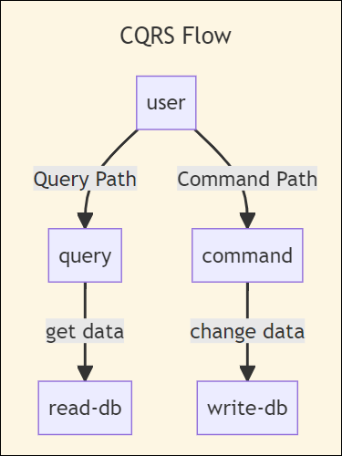

**CQRS** - Command Query Responsibility Segregation - is a design pattern used in software architecture to address the complexity and performance issues that can arise in systems handling both read (**query**) and write (**command**) operations. CQRS suggests segregating the data models and operations for reads and writes into separate components, optimizing each for its specific use case.

In a traditional monolithic architecture, the same data model and database schema are often used for both reading and writing data. However, as an application grows in complexity, the read and write patterns might have different requirements and performance characteristics. CQRS helps to tackle this by decoupling the data storage and retrieval mechanisms.

## How CQRS Works

These are some key features of CQRS and how it works.

### Separation of Models

Instead of using a single data model for both reading and writing, CQRS recommends having separate models. The command model is optimized for handling write operations, ensuring data consistency and integrity. The query model is designed for efficient data retrieval and is optimized for read operations.

### Command and Query Paths

The application's code is divided into two distinct paths: the Command Path and the Query Path. The Command Path handles write operations, such as creating, updating, or deleting data. The Query Path handles read operations and is optimized for querying and displaying data to users.

### Event Sourcing

In many CQRS implementations, event sourcing is used to capture all changes to the application state as a sequence of events. These events represent the transitions in the system's data. By replaying these events, you can reconstruct the state of the system at any point in time. This approach provides a reliable audit trail and can facilitate debugging and troubleshooting.

### Asynchronous Processing

CQRS often involves asynchronous communication between the Command and Query sides. Commands are processed by the Command Model and can generate events. These events are then propagated to the Query Model, which updates its data store asynchronously. This separation of processing can improve scalability and responsiveness.

### Optimized Data Stores

The Query Model often uses specialized data stores optimized for querying, such as read-only databases, caching mechanisms, or search indexes. These data stores are designed to efficiently retrieve and present data to users. Because write operations are asynchronous and use separate models, it's not unusual for data in the query store to lag behind for recent updates, unless specific measure are taken to address this behavior. Often the approach that is taken is to let the user know changes may take some time to appear, combined with implementing the user's change in the local app even if the query store doesn't yet reflect it. For example, after a user has added a comment to a conversation, the comment appears in their local browser/app even if it hasn't yet been handled by the command processor on the server (and thus isn't visible to anyone else).

## Conclusion

CQRS can bring several benefits, including improved performance, scalability, and maintainability of complex systems. However, it also introduces additional complexity and may not be suitable for all projects. Implementing CQRS requires careful consideration of the application's requirements and trade-offs.

It's important to note that while CQRS is a powerful pattern, it's not a one-size-fits-all solution. It's recommended to assess whether the complexity introduced by CQRS is justified by the specific needs of your application.

## References

- [Azure Architecture: CQRS](https://learn.microsoft.com/en-us/azure/architecture/patterns/cqrs)
- [Introducing CQRS (Ardalis)](https://ardalis.com/command-query-responsibility-separation/)
- [CQRS (Martin Fowler)](https://martinfowler.com/bliki/CQRS.html)
- [AWS Prescriptive Guidance: CQRS](https://docs.aws.amazon.com/prescriptive-guidance/latest/modernization-data-persistence/cqrs-pattern.html)