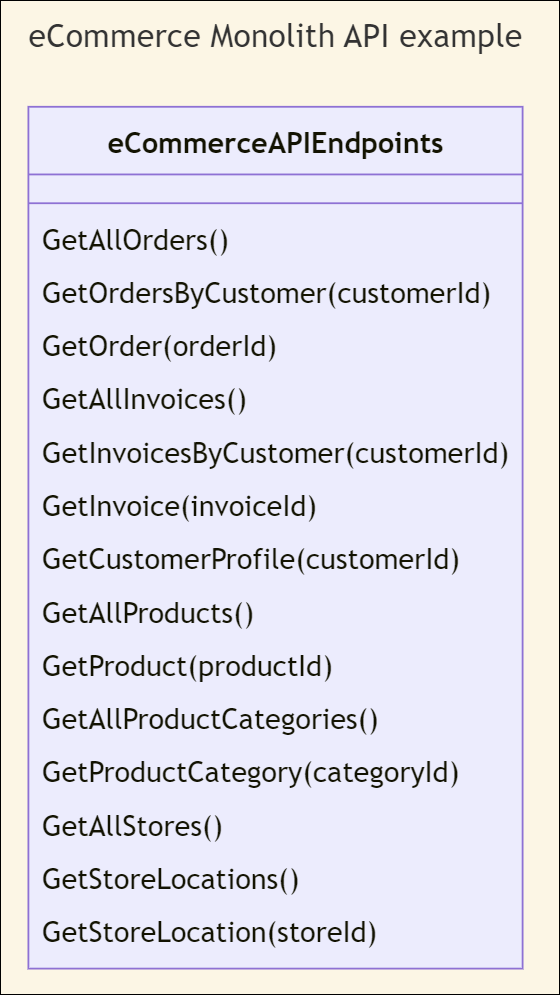
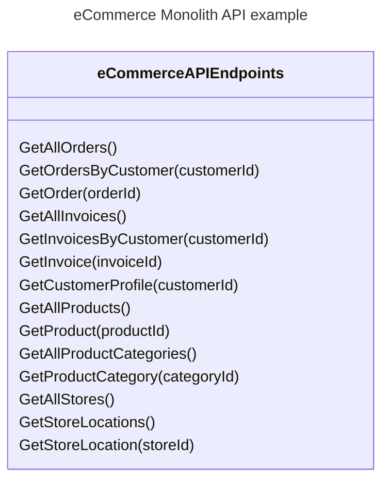
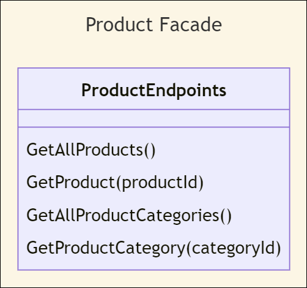
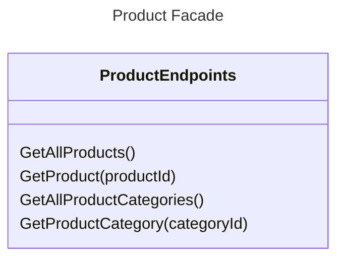

The Facade Pattern is used when you want a simpler interface for a subsystem of a complex system. The complex system typically contains a code smell known as [the big ball of mud](/antipatterns/big-ball-of-mud) that typically evolves from [the blob](/antipatterns/blob). By using a facade, you create an interface that only shows the necessary endpoints for a subset of a system rather than the entire complex system.

> **Note**: The subsystem does not know that the facade exists. There are ties from the facade to the subsystem, but not from the subsystem to the facade.

For example, suppose you have an eCommerce system with a monolithic API. The API has endpoints for orders, invoices, customer profiles, products, product categories, store locations, and more. 

<!--  -->

Those are many subsystems. Some of those may be related, but having them all in one API violates the [KISS](/principles/keep-it-simple) and [separation of concerns](/principles/separation-of-concerns) principles. Facades embrace [simplicity](/values/simplicity).

Suppose you have a client that needs to maintain the products on the site. Create a facade that makes it so that the client uses a facade that only deals with products and product categories. The client does not need to know that the other sections exist in the big ball of mud.

<!-- -->

By creating this facade, the client does not need to be concerned with customer IDs, order IDs, or invoice IDs.

## Facade Pattern in terms of DDD

When it comes to domain-driven development, think of the Facade Pattern like this:

- The domain - eCommerce - is too large to group all things into one API.
- Subdomains - such as Orders, Invoices, and Products - provide logical groupings  that may indicate where facades may be helpful.
- Bounded contexts provide the boundaries - the limitations - of those facades.

## See Also

- [Strangler Fig Pattern](/design-patterns/strangler-fig-pattern)

## References

- Amazon - [Design Patterns: Elements of Reusable Object-Oriented Software](http://amzn.to/vep3BT) - Gang of Four
- Pluralsight - [C# Design Patterns: Facade](https://app.pluralsight.com/library/courses/csharp-design-patterns-facade/table-of-contents)
