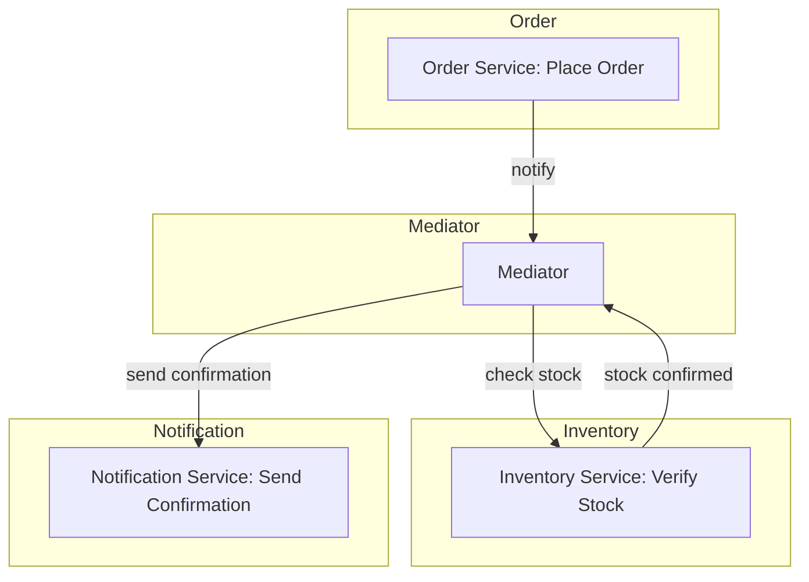

The Mediator pattern is a design pattern that facilitates communication between different components in a system without them needing to know about each other directly. Instead of components interacting with each other directly, they communicate through a central mediator, which manages the interactions and orchestration. This helps reduce dependencies, promote loose coupling, and make the system more modular and flexible. Commonly used in complex applications where many objects interact with one another—such as in user interfaces, messaging systems, or eCommerce applications—the Mediator pattern centralizes communication logic, making components easier to manage, extend, and test. This pattern is especially useful in large-scale systems, where reducing direct dependencies is essential for maintainability and scalability.

## An eCommerce Example of the Mediator

Consider this eCommerce situation:

- `PlaceOrderCommand` triggers the `PlaceOrderHandler` to place the order.
- `PlaceOrderHandler` notifies the Mediator to check the inventory.
- `CheckInventoryHandler` checks inventory and then requests the Mediator to send a notification.
- `SendNotificationHandler` completes the process by sending a confirmation notification.

In this example:

- The Mediator coordinates between modules.
- When an order is placed, the Order Service notifies the Mediator.
- The Mediator then informs the Inventory Service to check stock.
- Upon stock verification, the Mediator requests the Notification Service to send a confirmation.

The Order Service doesn't need to know about the Inventory Service or the Notification Service. Its sole focus is on order-related things. Once the Order Service is done placing the order, it can notify others of "Hey! I'm done with this work!" and then whoever needs to step in can step in. But the Order Service doesn't call to the Inventory Service or the Notification Service. All of that is handled by the conductor in the middle - the Mediator.

## Scenarios Best Suited for the Mediator Pattern

The Mediator pattern is beneficial when:

- There are multiple components that need to communicate in complex ways, especially when adding more components is expected.
- Components need to be decoupled to allow easier changes in individual modules without affecting others.
- You want to encapsulate workflows or orchestrations that would otherwise be spread across multiple classes.

## Benefits of the Mediator Pattern

There are many benefits that come from using the Mediator pattern.

### Loose Coupling

Components don't need to know about each other; they only interact through the Mediator. This promotes modularity and makes the system easier to manage, especially when adding or modifying components.

### Improved Readability and Maintenance

The Mediator centralizes communication logic, simplifying the understanding of interactions. With complex flows, having one place where all interactions are managed can make the system more maintainable.

### Easier Debugging and Testing

Since the Mediator encapsulates the communication between objects, testing interactions becomes simpler. You can mock or replace the Mediator in tests, focusing only on specific interactions without needing to initialize dependencies for each component.

### Encourages Single Responsibility Principle

By removing communication responsibilities from individual components, each class focuses solely on its main function, adhering to [SRP](/principles/single-responsibility-principle). In an eCommerce example, the `OrderService` is focused only on order-related logic, not on handling notifications or inventory checks.

### Scalability

As the number of interacting components increases, the Mediator pattern prevents exponential growth in dependencies by centralizing connections. This is especially helpful in complex systems like ERP or eCommerce platforms where many modules need to interact.

## Drawbacks of the Mediator Pattern

While there are many benefits to using the Mediator pattern, there are drawbacks to be aware of as well.

### Mediator Complexity

If the Mediator becomes responsible for too many interactions, it can become overly complex and monolithic, leading to a "god object" where the Mediator itself becomes hard to manage. This can offset some of the maintainability and readability benefits.

### Single Point of Failure

Since all interactions go through the Mediator, it becomes a critical component. If the Mediator fails, the entire interaction flow breaks. It also adds another layer of potential performance bottlenecks, as every request passes through it.

### Harder to Trace Distributed Systems

In large systems or microservices, tracing or debugging requests across modules can become challenging, as each service is abstracted from others. This could make it harder to diagnose issues if Mediator interactions aren’t properly logged or monitored.

### Limited Flexibility for Direct Interactions

The Mediator pattern may introduce unnecessary overhead if some components naturally need to interact directly. For simpler interactions, having every communication mediated can be inefficient.

### Potential Performance Impact

With every interaction routed through the Mediator, the pattern can add a performance cost, particularly in latency-sensitive applications. The pattern might be overkill if the interactions are simple or infrequent.

## Related Patterns

These are some other patterns you may see with the Mediator pattern.

### Command Pattern

The Command pattern is often paired with Mediator in systems that execute discrete actions or commands, such as CQRS. Commands encapsulate requests as objects, which the Mediator can route to appropriate handlers. This is especially useful when using libraries like MediatR, where commands and handlers are the foundation.

In [CQRS](/design-patterns/cqrs-pattern), the Mediator pattern is useful for routing commands (write operations) to specific handlers and queries (read operations) to others. This allows for independent scaling of read and write models, making it a common combination in distributed or microservices architectures.

### Observer Pattern

The Observer pattern complements Mediator by allowing components to subscribe to events or updates from the Mediator. When an event occurs, the Mediator can notify subscribers without direct dependency chains, further enhancing decoupling.

### Chain of Responsibility

This pattern is helpful when the Mediator needs to delegate requests across a series of handlers, each capable of handling part of the workflow or passing the request along. The [Chain of Responsibility](/design-patterns/chain-of-responsibility-pattern) keeps individual handler responsibilities clear while allowing the Mediator to orchestrate complex processing.

## Additional Resources

- [MediatR](https://github.com/jbogard/MediatR)
- [Ardalis' Clean Architecture template sample](https://github.com/ardalis/CleanArchitecture/tree/main/sample) - uses MediatR as its Mediator
- [Immediate Domain Event Salvation with MediatR](https://ardalis.com/immediate-domain-event-salvation-with-mediatr/)
- [dotnetFlix: Use the Decorator, Mediator and Chain of Responsibility pattern in C#](https://www.youtube.com/watch?v=eSQHpfaYspw)
- [MediatR Validation and the Chain of Responsibility Pattern](https://www.youtube.com/watch?v=row6bEoKn20)
- [Fluent Validation in MediatR with Results](https://www.youtube.com/watch?v=9KuLsPV8BYU)