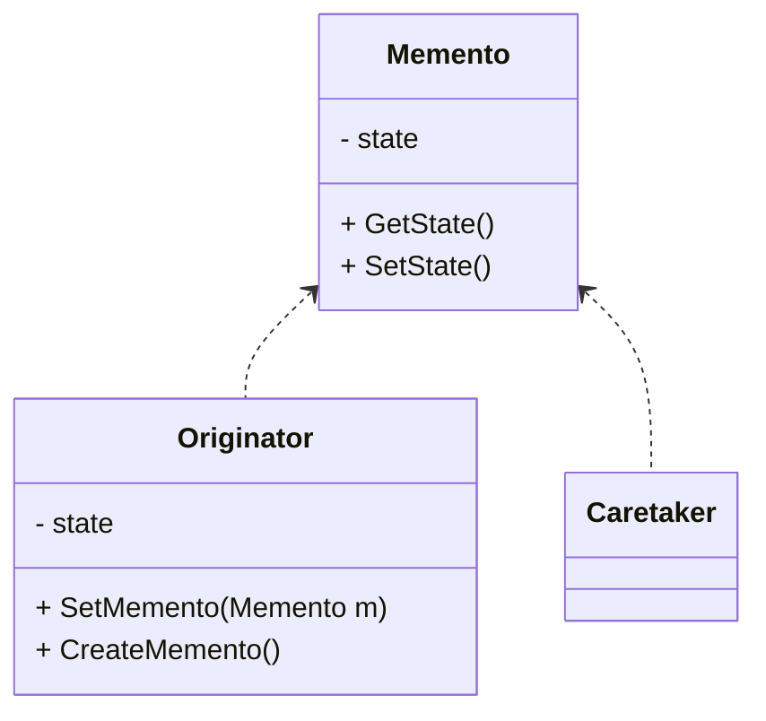
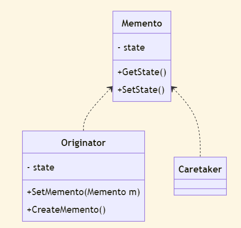
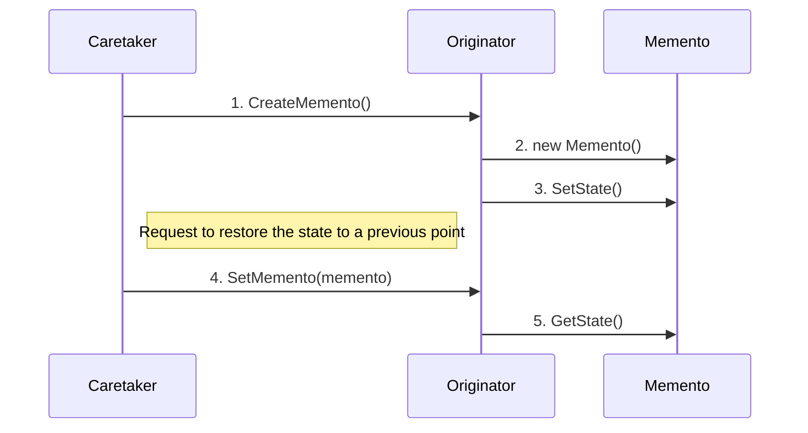
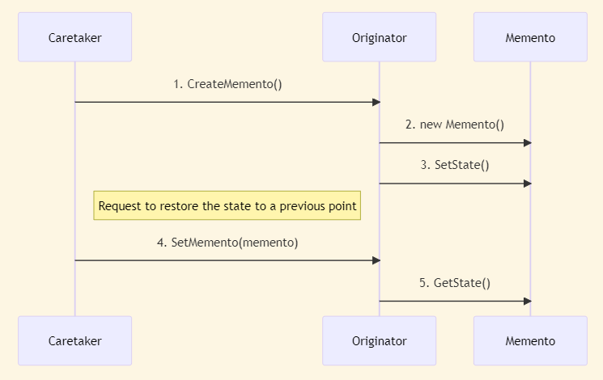

The Memento pattern - also known as the Token pattern - is used to externalize an object's internal state for restoration later, without violating [encapsulation](/principles/encapsulation). This pattern is part of the patterns covered in _Design Patterns_ by the Gang of Four. It is a behavioral pattern, as it allows you to add undo and replay behaviors to an object.

A **memento** holds an object's internal state to be retrieved later. Think of this like save points in a video game,  stacks for tracking changes, or commits in source control. The key thing to note with the Memento pattern is that it captures an object's _internal_ state without violating encapsulation.

## When to Use Memento

This pattern is best suited for cases where objects need to be restored to a particular state. Cases for this include:

- Undo/redo in an editor application
- Rolling back objects to a previous state when cancelling an action
- Providing access to internal state without breaking encapsulation

## Structure of Memento Pattern

There are three key classes to the memento pattern - Originator, Caretaker, and Memento.

- The Memento class holds state (`state`). This is accessible through two methods - `GetState()` and `SetState()`.
- The Originator class has the state (`state`) to be stored in the memento. It can create mementos with `CreateMemento()`. It can also set a memento with `SetMemento(Memento m)`.
- The Caretaker class is responsible for the safekeeping and does not perform work on a memento.

<!--

-->



These classes work in the following way:

1. The caretaker requests a memento for the originator with `CreateMemento()`.
2. The originator creates a new memento through `new Memento()`.
3. The originator sets the state of the memento using `SetState()`.
4. If the object needs to be restored to a previous state, the caretaker will pass the request to the originator using `SetMemento(memento)`.
5. The originator gets the previous state using `GetState()`.

<!--

-->



The goal is to keep the mementos small. Also, the caretaker only deals with the memento through the originator. The caretaker never directly changes a memento. The caretaker only tracks the previous states. The originator handles the creation and restoring of mementos.

## Sample Code for the Memento Pattern

Here is a how the Memento pattern could be implemented using C#:

```csharp
using System;
using System.Collections.Generic;

// Originator: The object whose state needs to be saved
class Originator
{
    private string _state;

    public string State
    {
        // GetState()
        get { return _state; }
        // SetState()
        set
        {
            _state = value;
            Console.WriteLine("State set to: " + _state);
        }
    }

    // Creates a memento with the current state
    public Memento CreateMemento()
    {
        return new Memento(_state);
    }

    // Set the memento to a specific state
    public void SetMemento(Memento memento)
    {
        _state = memento.State;
        Console.WriteLine("State restored to: " + _state);
    }
}

// Memento: Stores the internal state of the Originator
class Memento
{
    public string State { get; }

    public Memento(string state)
    {
        State = state;
    }
}

// Caretaker: Manages and keeps track of multiple mementos
class Caretaker
{
    public List<Memento> Mementos { get; } = new List<Memento>();
}

class Program
{
    static void Main(string[] args)
    {
        // Create an originator
        Originator originator = new Originator();

        // Create a caretaker to manage mementos
        Caretaker caretaker = new Caretaker();

        // Set the initial state and save it in a memento
        originator.State = "State 1";
        caretaker.Mementos.Add(originator.CreateMemento());

        // Change the state and save it in another memento
        originator.State = "State 2";
        caretaker.Mementos.Add(originator.CreateMemento());

        // Restore the state from the first memento
        originator.RestoreMemento(caretaker.Mementos[0]);

        Console.ReadLine();
    }
}
```

Code examples for implementing undo/redo in a game can be seen in [C# Design Patterns: Memento (Pluralsight)](https://www.pluralsight.com/courses/c-sharp-design-patterns-memento). The companion code for the course is here: [C# Design Patterns: Memento (GitHub)](https://github.com/ardalis/DesignPatternsInCSharp/tree/master/DesignPatternsInCSharp/Memento)
