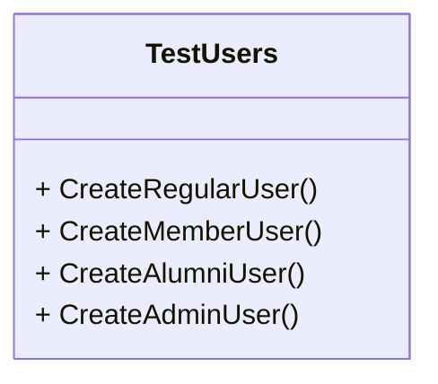

The Object Mother pattern was [described by Martin Fowler](https://martinfowler.com/bliki/ObjectMother.html) as a catchy name for a factory that returns standard fixtures that can be used across multiple tests. The name itself was coined on a Thoughtworks project.

The Object Mother pattern builds upon the [Factory Method pattern](/design-patterns/factory-method-pattern). The Object Mother pattern adds methods to customize the creation of objects, update the objects during testing, and enable object deletion from data storage. Object creation is handled in the Object Mother class, rather than within the tests.

For example, an Object Mother class for users - such as in [devBetter](https://devbetter.com) - could look something like this:

The downfall to the Object Mother pattern is that the class can become bloated over time with repetitive code. [DRY](/principles/dont-repeat-yourself) is important to keep in mind, as there may be parts of object creation that are repeated between different types of objects with the same mother.

An alternative to the Object Mother pattern is the [Builder pattern](/design-patterns/builder-pattern).

## References

- [Object Mother - Martin Fowler](https://martinfowler.com/bliki/ObjectMother.html)
- [Object Mother - C2.com](https://wiki.c2.com/?ObjectMother)

## See Also

- [Builder Pattern](/design-patterns/builder-pattern)
- [Factory Method Pattern](/design-patterns/factory-method-pattern)
- [Testing - Overview](/testing/testing-overview)