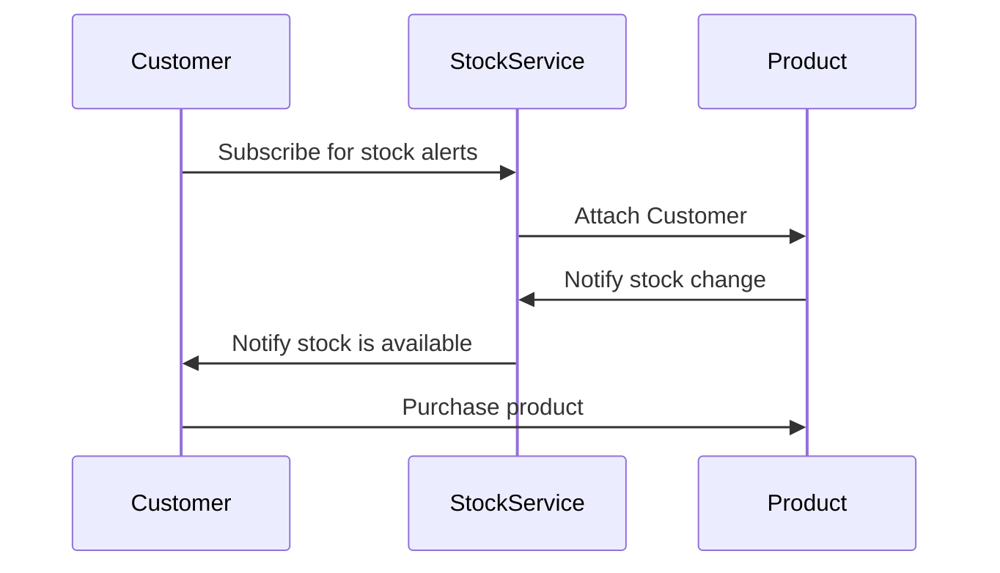

The Observer pattern is a fundamental design pattern in software development that facilitates communication between objects in a way that promotes loose coupling and flexibility. In this pattern, a subject maintains a list of observers that are automatically notified of any changes in the subject's state. This allows observers to react to changes without the subject needing to know specific details about the observers. Commonly used in event-driven systems, GUI frameworks, and real-time applications, the Observer pattern enhances maintainability and scalability while enabling dynamic relationships among components.

## How It Works

The Observer has the following key components:

- **Subject**: Central component that holds and manages observers.
- **Observer**: Interface or abstract class for implementing observers.
- **ConcreteSubject**: Specific subject implementation that contains the state.
- **ConcreteObserver**: Specific observer implementation that reacts to state changes.

In the context of an eCommerce application, these components could be represented as follows:

- **Subject**: A `Product` class that maintains stock information.
- **Observer**: An `Observer` interface with an `Update()` method.
- **ConcreteSubject**: A `ConcreteProduct` class that implements the `Product` class and tracks the stock level.
- **ConcreteObserver**: A `Customer` class that implements the `Observer` interface and receives stock notifications.

## An Example: Product Stock

In this example, a customer wants to know when a new shipment of a product arrives. This is what it looks like:

- The customer subscribes to stock alerts through the StockService.
- The StockService attaches the customer to the product.
- When the product stock changes (e.g., a new shipment arrives), the StockService notifies the customers. Customers receive the notification and can then choose to purchase the product.

In the eCommerce example of the Observer pattern that we discussed, the observers are the customers who have subscribed to receive notifications about the product's stock status. Here's a breakdown of the roles:

- **Subject**: The Product that maintains its stock status and notifies observers when there are changes (e.g., stock becomes available).
- **Observer**: The Customer who subscribes to stock alerts. They want to be notified when the product is back in stock.
- **Notification Mechanism**: The StockService acts as an intermediary that manages the relationship between the Product and the Customers. It handles the subscription process, as well as notifying all observers (customers) when the product's stock changes.

## Use Cases for the Observer Pattern

These are some common use cases for the observer pattern:

- **Event Handling Systems**: GUI frameworks often use the Observer pattern to handle user interactions.
- **Data Binding**: In applications where data models need to be synchronized with views (like in MVC architectures).
- **Real-Time Notifications**: Systems where multiple components need to be notified of state changes, such as chat applications or stock tickers.
- **Publish-Subscribe Systems**: Messaging systems where publishers send messages to multiple subscribers.

## Benefits of the Observer Pattern

These are some benefits of the Observer pattern.

- **Loose Coupling**: The subject and observers are loosely coupled, meaning that the subject does not need to know the details of its observers. This enhances flexibility and maintainability.
- **Dynamic Relationships**: Observers can be added or removed at runtime, allowing for dynamic relationships and the ability to modify behavior without changing the subject.
- **Consistency**: The Observer pattern helps ensure that all observers receive updates and remain consistent with the state of the subject.

## Drawbacks of the Observer Pattern

These are some of the drawbacks that are seen with the Observer pattern:

- **Memory Leaks**: If observers are not properly removed, it can lead to memory leaks, especially in environments where long-lived subjects exist.
- **Complexity**: It can introduce additional complexity, as the relationship between subjects and observers may become hard to trace and manage as the system grows.
- **Performance Concerns**: If there are many observers, notifying all of them can incur performance overhead, especially if observers take time to process updates.

## References

- [Head First Design Patterns](https://amzn.to/3g8KL4l)