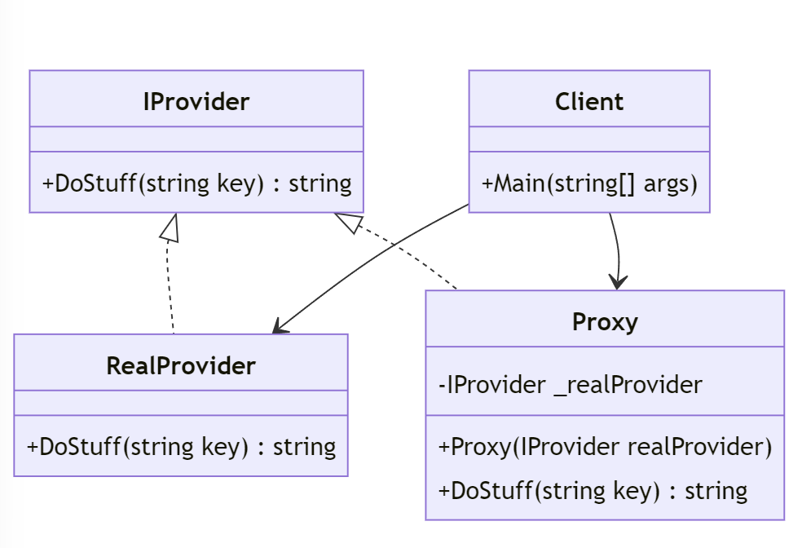

The Proxy pattern provides a placeholder for another object to control access to it. It can be useful for abstracting the access to data objects, providing additional functionality such as lazy loading, access control, or caching.

At a high level, the pattern is typically implemented with the following:

- An interface
- An implementation of the interface
- A proxy to wrap around the implementation of the interface
- A client to consume the proxy

There are different types of proxies that belong in the general class of the Proxy pattern.  These types include:

- Virtual Proxy Pattern
- Remote Proxy Pattern
- Cache Proxy Pattern
- Synchronization Proxy Pattern
- Smart Proxy Pattern

## Virtual Proxy Pattern

A **virtual proxy** can defer the creation and initialization of a real resource until it's actually needed, improving performance by avoiding unnecessary overhead and reducing resource consumption. The proxy handles the creation and management of the real object, allowing the client to focus on its core functionality.

There are some drawbacks to this pattern. Implementing lazy loading and managing the creation of the real object can add complexity to the codebase. If not implemented carefully, the overhead of creating and managing proxies can outweigh the benefits.

When creating the real object is resource-intensive or time-consuming, it may make sense to use a virtual proxy. When dealing with loading heavy resources such as large images, a virtual proxy would be advisable.

## Remote Proxy Pattern

A **remote proxy** can encapsulate the network communication details and provide a local representation of a remote object, making it transparent to the client. This type of proxy hides the complexities of remote communication, providing a local representation of the remote object. By caching results or batching requests, remote proxies can reduce the overhead of network communication.

While the remote proxy can encapsulate the network communications and be used to help reduce the overhead of network communication, it comes with some drawbacks. Remote proxies introduce latency due to network communication, which can impact application performance. The reliability of remote proxies depends on network connectivity, making them vulnerable to network failures.

When it comes to network-related applications, remote proxies can help when working with distributed systems where objects are located on remote servers. Another use case for remote proxies is when interacting with web APIs or microservices over the network.

## Cache Proxy Pattern

A **cache proxy** helps to reduce the load of expensive queries by storing values for a set period of time. By caching results, caching proxies can reduce the load on servers and databases.

However, there are things that need to be considered when implementing a cache proxy. Maintaining cache consistency can be challenging, especially in distributed or multi-threaded environments.
Determining when to invalidate cached data and keeping the cache up-to-date can be complex.

A cache proxy can be beneficial in applications that read data more frequently than they write. It is also beneficial when the result of a computation is deterministic and expensive to compute, as caching the result can improve performance.

## Synchronization Proxy Pattern

A **synchronization proxy** is used in concurrency situations to ensure that access to the real object is synchronized across multiple threads, preventing data corruption in multi-threaded environments. By encapsulating synchronization logic, synchronization proxies make it easier to manage concurrency issues.

Synchronization introduces overhead due to locking and context switching, which can impact application performance. Incorrect usage of locks can lead to deadlocks, where threads are waiting indefinitely for each other to release locks.

When multiple threads need to access and modify shared resources concurrently, a synchronization proxy can be used to ensure thread safety. When certain operations must be executed atomically to maintain data consistency, a synchronization proxy can help.

## Smart Proxy Pattern

**Smart proxies** can enforce access control policies, ensuring that only authorized users can access certain operations or data. They can log method invocations and perform auditing to track usage patterns and detect anomalies.

Implementing additional functionality in proxies can increase code complexity and maintenance overhead. Adding extra logic to proxies can introduce performance overhead, especially for frequently accessed operations.

When security is a primary concern and access control must be enforced at the object level, a smart proxy can allow you to add that functionality without changing the object's code. Smart proxies can also be used for logging user actions and maintaining audit trails for compliance or debugging purposes.

## Conclusion

Each proxy pattern offers distinct benefits and is suitable for different scenarios. Choosing the right pattern depends on the specific requirements of your application, such as performance considerations, concurrency requirements, and security concerns.

## Learn More

- [C# Design Patterns: Proxy (Pluralsight)](https://www.pluralsight.com/courses/c-sharp-design-patterns-proxy)