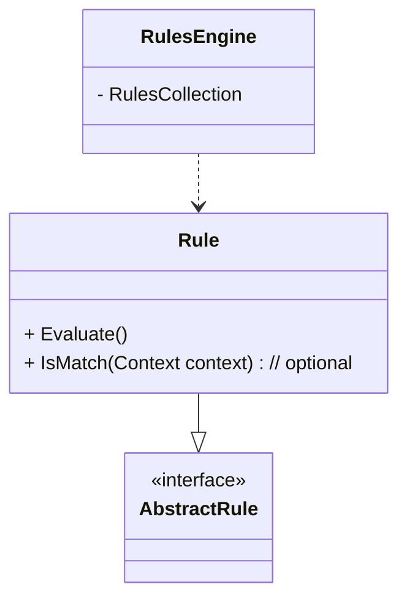

The Rules Engine Pattern is classified as a behavioral design pattern, as noted in the _Design Patterns_ book by the Gang of Four.
This pattern is a design pattern that allows developers to define and manage complex business rules outside of the main application code. It encapsulates the logic for evaluating these rules and applying them to data, making it easier to modify and maintain the rules without affecting the underlying code.

The Rules Engine Pattern has three parts - the rules engine, a collection of rules, and an input to which the rules need applied. 

A **rules engine** processes a set of rules and applies the rules to generate a result. A **rule** describes a condition and may calculate a value.

An example of something that uses a rules engine could be your email client. If your email client allows you to set up automatic handling of email - such as filtering of emails so that you can move messages with a subject or sender to a folder, it is most likely using a rules engine.

Another example of a rules engine is when you go shopping online. Think of the stores that have 25% off of products in a particular category, individual items on sale, and also a discount for free shipping if an order hits a certain value. The 25% off of products in a particular category is a rule. Individual items on sale are separate rules. The discount for free shipping is another rule. The rules engine knows how to handle the rules, prioritizing rules, and generating the cart totals for the online shopping transaction.

## Benefits of Using a Rules Engine

These are some of the benefits for using this approach:

- **Improved maintainability**: Rules can be easily added, modified, or removed without changing the core application code.

- **Increased flexibility**: Business rules can be adapted to changing requirements without requiring redeployment of the entire application.

- **Enhanced reusability**: Rules can be shared and reused across different applications and domains.

- **Clearer separation of concerns**: Business logic is separated from application code, making the code more maintainable and easier to understand.

- **Centralized management**: Rules are managed in a centralized location, providing better control and visibility over business logic.

## Classes in the Rules Engine Pattern

## Sample Logic that Could Benefit from the Rules Engine Pattern

If you think you would want to process this as a series of `if` statements, that is an option. However, the Rules Engine may make more sense.

## Refactoring Guidance for this Pattern

- Extract the individual `if` conditions into methods.
- Convert the methods into rules.
- Create the Rules Engine to evaluate the rules.
- Replace the old `if` stack with a call to the Rules Engine.

## Guidance for Rules for a Rules Engine

These are some key things to note about rules:

- Each rule should follow the [Single Responsibility Principle](/principles/single-responsibility-principle).
- In order to ensure the rule follows the Single Responsibility Principle, keep the [KISS Principle](/principles/keep-it-simple) in mind. Keep it simple!
- Rules may be ordered, filtered, or aggregated as necessary.
- The rules engine determines how to process the rules.
  - The logic for determining priorities of the rules lives within the rules engine.

When implementing the rules engine:

- Accept the rules collection in the engine constructor.
- Apply the rules to a given input - a context or system state.
- Apply, aggregate, and filter the rules in an order appropriate for the business logic.
- Allow rules and sets of rules to be swapped via methods.

## Related Patterns

- [Specification Pattern](/design-patterns/specification-pattern) - separate query logic from your application
- Chain of Responsibility - used for sequencing the rules for processing
- [Strategy Pattern](/design-patterns/strategy-pattern) - encapsulate rule execution strategies
- Command - encapsulate rule actions as discrete commands for testability and separation of concerns
- Observer - can be used to notify parties when rules are triggered or applied

## Frequently Asked Questions

**Is it violating Open Closed principle if the rule returns a value that includes extra information?** I've got a combination of First match and aggregation.

No that’s probably fine. If your engine code gets too complex maybe you create types representing the different kinds of rules and/or their results that let you Replace Conditional with Polymorphism.

**In the case of ordered rules, is it wrong to pass (and change) contextual information from one rule to the next?**

This isn't wrong, but Chain of Responsibility might be a better fit.

## References

- [C# Design Patterns: Rules Engine Pattern (Pluralsight)](https://www.pluralsight.com/courses/c-sharp-design-patterns-rules-pattern)
- [Use the Decorator, Mediator, and Chain of Responsibility Patterns in C#](https://www.youtube.com/watch?v=eSQHpfaYspw)