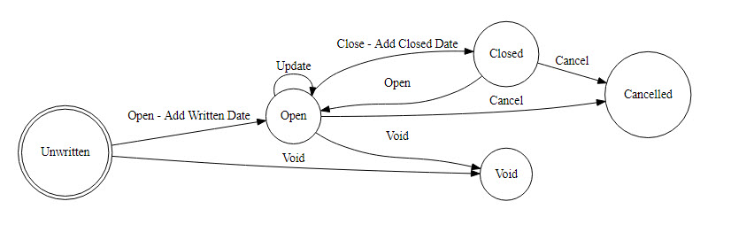
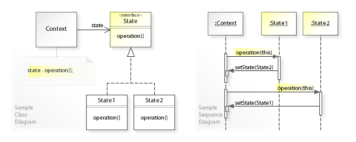

The State Design Pattern is used to model changes in the status or state of an object by delegating rules for such changes to individual objects representing each possible state. You can think of the state pattern as representing a Finite State Machine, like this one for insurance policies:



You can [generate diagrams like this one from text using online tools like WebGraphViz](https://ardalis.com/simple-flowcharts-and-state-diagrams-with-webgraphviz).

In the diagram above, which represents a [_graph_](https://en.wikipedia.org/wiki/Graph_(discrete_mathematics)), each circle is a _node_ and each connecting arrow is called an _edge_. The State Design Pattern models all nodes within a diagram as a single type, and each individual node as a specific subtype. The base node type defines methods for all of the possible edges; subclasses implement the methods that represent allowable state transitions from that node. Invalid operations are implemented such that they throw exceptions.

The diagram below shows the UML diagram for the State pattern on the left, and a sequence diagram on the right. The context in this case is the type whose state is being modeled (e.g. an insurance policy). The context exposes a State property that can be read to see its state, as well as operations that can be performed to mutate the object's state. Whenever a state mutating method is called on the context, that method simply delegates the call to the State property's corresponding method.



You can see from the sequence diagram two additional implementation details. First, every state implementation takes in a reference to the context via its constructor. Second, the individual state instances use this access to the context object to change its state, setting the State property to a different state instance type. Typically the context type will define all of its possible states and expose them such that the separate state instance types can access them for this purpose.

## State Pattern in C#

You can view a [complete example of the State pattern in C# with unit tests on GitHub](https://github.com/ardalis/StatePattern). The example uses an insurance Policy as its context object, with states as shown in the initial diagram above (Unwritten, Open, Closed, Cancelled, and Void). The IPolicyState interface defines all of the different operations that can be used to change the state of a policy:

```java
public interface IPolicyState
{
    void Open(DateTime? writtenDate = null);
    void Void();
    void Update();
    void Close(DateTime closedDate);
    void Cancel();
}
```

The Policy class implements this interface (as do all of the individual state subtypes) and delegates all calls to its State property.

```java
public partial class Policy : IPolicyState
{
    private Policy()
    {
        _cancelledState = new CancelledState(this);
        _closedState = new ClosedState(this);
        _openState = new OpenState(this);
        _unwrittenState = new UnwrittenState(this);
        _voidState = new VoidState(this);
        State = _unwrittenState;
    }

    public Policy(string policyNumber) : this()
    {
        Number = policyNumber;
    }

    public int Id { get; set; }
    public string Number { get; set; }
    public DateTime? DateOpened { get; private set; }
    public DateTime? DateClosed { get; private set; }

    private readonly IPolicyStateCommands _cancelledState;
    private readonly IPolicyStateCommands _closedState;
    private readonly IPolicyStateCommands _openState;
    private readonly IPolicyStateCommands _unwrittenState;
    private readonly IPolicyStateCommands _voidState;
    public IPolicyStateCommands State { get; private set; }

    public void Cancel()
    {
        State.Cancel();
    }

    public void Close(DateTime closedDate)
    {
        State.Close(closedDate);
    }

    public void Open(DateTime? writtenDate = null)
    {
        State.Open(writtenDate);
    }

    public void Update()
    {
        State.Update();
    }

    public void Void()
    {
        State.Void();
    }
}
```

From the Unwritten state, the only valid operations that can be performed on a policy are Open and Void. This logic is represented in the UnwrittenState class, which implements the IPolicyStateCommands interface that includes all of IPolicyState as well as a list of valid commands (used to build the UI).

```java
public partial class Policy
{
    public class UnwrittenState : IPolicyStateCommands
    {
        private readonly Policy _policy;

        public UnwrittenState(Policy policy)
        {
            _policy = policy;
        }
        public void Cancel() => throw new InvalidOperationException("Cannot cancel a policy before it's been Opened.");

        public void Close(DateTime closedDate) => throw new InvalidOperationException("Cannot close a policy before it's been Opened.");

        public void Open(DateTime? writtenDate = null)
        {
            _policy.State = _policy._openState;
            _policy.DateOpened = writtenDate;
        }

        public void Update() => throw new InvalidOperationException("Cannot update a policy before it's been Opened.");

        public void Void()
        {
            _policy.State = _policy._voidState;
        }

        public List<string> ListValidOperations()
        {
            return new List<string> { "Open", "Void" };
        }

    }
}
```

Note that in this example each State subtype is defined as an inner class within the Policy class. The classes are defined in separate partial Policy classes so they can reside in separate files without bloating the Policy class definition. Since these State classes are defined as inner classes, they have direct access to private member variables defined in Policy, so there is no need to expose Policy's list of possible states publicly.

## When to Use

The State pattern is a good candidate to apply when you have an object that has a relatively complex set of possible states, with many different business rules for how state transitions occur and what must happen when state changes. If the object simply has a status property that can be updated at any time to any status with minimal special logic, the State pattern adds unnecessary complexity. However, for objects that represent real-world concepts with complex work flows, the State pattern can be a good choice.

## Advantages

The State pattern minimizes conditional complexity, eliminating the need for if and switch statements in objects that have different behavior requirements unique to different state transitions. If you're able to represent the object's state using a finite state machine diagram, it's fairly easy to convert the diagram into the State design pattern's types and methods.

## Disadvantages

The State pattern requires a lot of code to be written. Depending on how many different state transition methods are defined, and how many possible states an object can be in, there can quickly be dozens or more different methods that must be written. For N states with M transition methods, the total number of methods necessary will be (N+1)\*M. In the example above for an insurance policy, there are 5 different states, each of which must define 5 methods (ignoring the ListValidOperations method for now), for a total of 25 methods on the State types. Then, the Policy context type must also define the 5 state transition methods, for a total of 30 methods that must be written.
