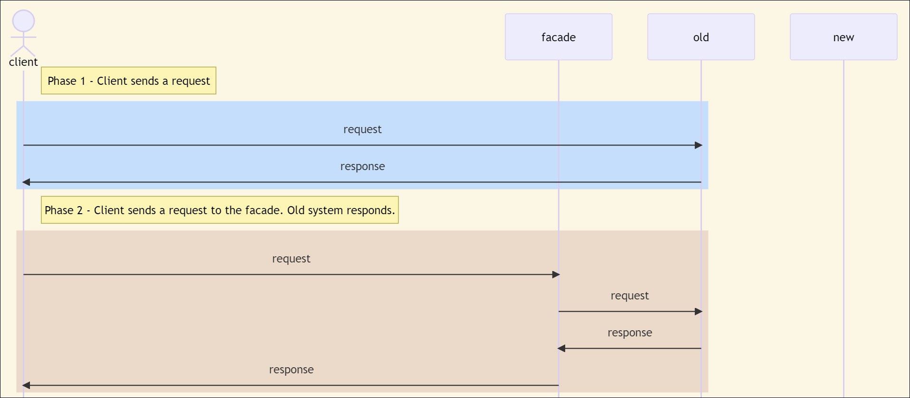
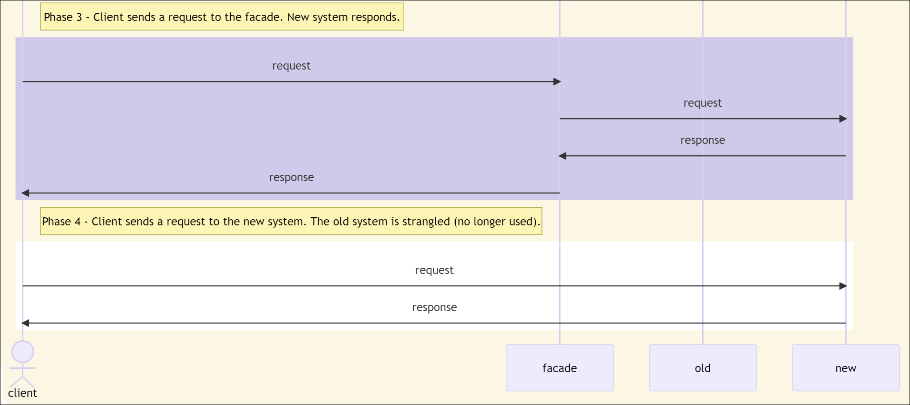
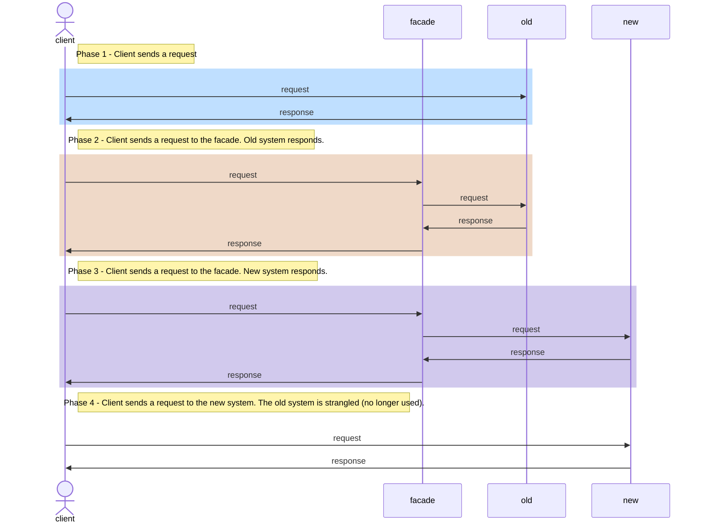

Whether you are refactoring from a monolith to microservices or migrating from one technology to another - such as ASP.NET WebForms to Blazor, the change can be a large undertaking. The Strangler Fig pattern enables you to take these migrations at a slower pace, migrating from one system to another system on a module basis rather than in its entirety.

## When to Use

When you need to migrate legacy backend architecture to a newer architecture over a long period of time, the Strangler Fig pattern makes it so that you can migrate to a newer system with minimal disturbance to the existing system.

## When Not to Use

If the system replacement is a small system, it may not make sense to use the Strangler Fig pattern. Don't drag it out if you can migrate the system in a shorter period of time.

If the backend calls cannot be intercepted, then there is nothing to require the use of facades.

## How It Works

The Strangler Fig pattern gets its name and general pattern from the strangler fig tree. This is the tree:

Photo by <a href="https://unsplash.com/@davidclode?utm_source=unsplash&utm_medium=referral&utm_content=creditCopyText">David Clode</a> on <a href="https://unsplash.com/photos/WS3PSqN2QAs?utm_source=unsplash&utm_medium=referral&utm_content=creditCopyText">Unsplash</a>

Strangler Fig trees germinate in a host tree. As the plants grow, the roots grow from the top of the host tree down to the ground. Once the roots are established, the fig tree grows and takes over - strangles - its host.

With regards to software development, the Strangler Fig pattern uses [the Facade pattern](./facade-pattern) to shift the software system's roots from the old system to the new system. Much like a strangler fig, when all of the roots have been replaced, the new system takes on a life of its own, strangling the old system.

<!-- TODO: Place diagrams of this here

 -->

## Advantages

These are benefits of the Strangler Fig pattern:

- You can access the old services while shifting into newer development.
- You can add new services to the facade and newer platform while still being able to use old services.
- This can reduce risk in system transformation by making incremental migrations at a slower pace. You can also pause the migration and use both old and new services through the facades or proxies of the Strangler Fig pattern.

## Disadvantages

When it comes to migrating legacy systems to newer systems using the Strangler Fig pattern, there are still some issues to be aware of:

- You need to be able to roll back to the old way quickly and easily in case things go wrong.
- Development may stall since this pattern allows for working with both old and new systems. If that happens, development teams may find themselves managing multiple systems longer than initially desired.
- Routing between the two systems can require extensive maintenance effort.

## References

- [Martin Fowler - Strangler Fig Application](https://martinfowler.com/bliki/StranglerFigApplication.html)
- [Incremental ASP.NET to ASP.NET Core update](https://learn.microsoft.com/en-us/aspnet/core/migration/inc/overview?view=aspnetcore-7.0)
- [Azure Architecture - Cloud Design Patterns - Strangler Fig pattern](https://learn.microsoft.com/en-us/azure/architecture/patterns/strangler-fig)
- [AWS: The strangler fig pattern](https://docs.aws.amazon.com/prescriptive-guidance/latest/modernization-aspnet-web-services/fig-pattern.html)
- [Google Cloud Architecture Center - Refactoring a monolith into microservices](https://learn.microsoft.com/en-us/azure/architecture/patterns/strangler-fig)
- [RedHat: How to architect intelligent automation using the Strangler pattern: A real-world exaxmple](https://www.redhat.com/architect/insurance-process-automation-strangler-pattern)