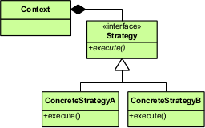

The Strategy Design Pattern allows an object to have some or all of its behavior defined in terms of another object which follows a particular interface.  A particular instance of this interface is provided to the client when it is instantiated or invoked, providing the concrete behavior to be used.  The Strategy design pattern is used extensively to achieve the [Single Responsibility Principle](/principles/single-responsibility-principle), the [Explicit Dependencies Principle](/principles/explicit-dependencies-principle), and the [Dependency Inversion Principle](/principles/dependency-inversion-principle), and is a key to [Dependency Injection](/practices/dependency-injection) and the use of [Inversion of Control](/principles/inversion-of-control) Containers.

## Intent

Define a family of algorithms, encapsulate each one, and make them interchangeable.  Strategy lets the algorithm vary independently from clients that use it. \[[GoF](http://amzn.to/vep3BT)\]

## Structure



Structurally, the Stategy Design Pattern typically takes the shape of having an interface or abstract base class that defines and encapsulates the "algorithm" in question. Then, specific implementations of this interface are created. If done as part of a refactoring, frequently tightly coupled code is extracted from an existing class or method, to be replaced by an interface. The tightly coupled, implementation-specific code is then moved into an implementation of this interface.

## Example

Strategy is frequently employed as a means of Dependency Injection. In this example, the hard-coded references to the local entity framework dbcontext have been replaced with an interface, which in this case is using the [Repository pattern](/design-patterns/repository-pattern). Note that the _**new**_ keyword is almost entirely absent - it is only used in the "poor man's dependency injection" used by the default constructor. Even this can be removed once an IOC container is added to the project, which then has the responsibility of instantiating the objects needed for the application to execute. Remember, "[new is glue](http://ardalis.com/new-is-glue)" - you don't want to instantiate dependencies directly if you can avoid it. Prefer to have such dependencies passed into your class, thus following the [Explicit Dependencies Principle](/principles/explicit-dependencies-principle) (and frequently using the Strategy pattern to do so).

```java
public class MoviesController : Controller
{
    private readonly IMovieRepository _movieRepository;
    public MoviesController(IMovieRepository movieRepository)
    {
        _movieRepository = movieRepository;
    }

    public MoviesController() : this(new EfMovieRepository())
    {}

    // GET: /Movies/
    public ActionResult Index(string movieGenre, string searchString)
    {
        ViewBag.movieGenre = new SelectList(_movieRepository.ListGenres());
        return View(_movieRepository.ListMovies(movieGenre,searchString));
    }
}

public interface IMovieRepository
{
    IEnumerable<string> ListGenres();
    IEnumerable<Movie> ListMovies(string movieGenre, string searchString);
}

public class EfMovieRepository : IMovieRepository
{
    private readonly MovieDbContext db = new MovieDbContext();
    public IEnumerable<string> ListGenres()
    {
        var genreLst = new List<string>();

        var genreQry = from d in db.Movies
                        orderby d.Genre
                        select d.Genre;

        genreLst.AddRange(genreQry.Distinct());

        return genreLst.AsEnumerable();
    }

    public IEnumerable<Movie> ListMovies(string movieGenre, string searchString)
    {
        var movies = from m in db.Movies
                        select m;

        if (!String.IsNullOrEmpty(searchString))
        {
            movies = movies.Where(s => s.Title.Contains(searchString));
        }

        if (!string.IsNullOrEmpty(movieGenre))
        {
            movies = movies.Where(x => x.Genre == movieGenre);
        }
        return movies.AsEnumerable();
    }
}
```

## References

Amazon - [Design Patterns: Elements of Reusable Object-Oriented Software](http://amzn.to/vep3BT) \[GoF\]

Videos - [Design Patterns Library @ Pluralsight](http://bit.ly/DesignPatternsLibrary)

[New is Glue](http://ardalis.com/new-is-glue) - [Ardalis](http://ardalis.com/)
