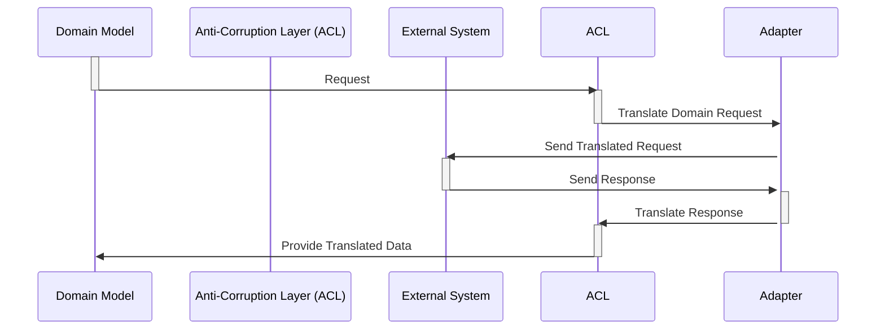

An Anti-Corruption Layer (ACL) is a set of defensive patterns placed between the domain model and other bounded contexts or third party dependencies. The intent of this layer is to prevent the intrusion of foreign concepts and models into the domain model. 

## Purpose of the ACL

These are some of the purposes of the ACL:

- **Preserves the integrity of the domain model**: By isolating the domain model from external concepts, the ACL prevents them from leaking into the domain and corrupting its purity.
- **Encapsulates technological and technical details**: The ACL hides the specifics of how the external systems work from the domain model, allowing the domain model to remain focused on its core business logic.
- **Promotes loose coupling**: The ACL enables the domain model to be independent of the external systems, making it easier to change or replace them without affecting the domain model itself.

## How the ACL Works

This diagram shows the sequence of interactions within an ACL:

1. The Domain Model activates and sends a request to the Anti-Corruption Layer (ACL).
2. The ACL activates and uses an Adapter to translate the domain request into the format and semantics of the External System.
3. The Adapter activates and communicates with the External System to send the translated request.
4. The External System activates and processes the request, then sends back a response to the adapter.
5. The Adapter activates and translates the response into the format and semantics of the domain model.
6. The Adapter de-activates and the ACL activates, then provides the translated data to the Domain Model.
7. The ACL de-activates and the Domain Model activates, receiving the translated data.

Here is a sequence diagram that shows these steps and how the components interact.

## Design Patterns in the ACL

This layer is typically made up of several well-known design patterns such as [Facade](/design-patterns/design-patterns-overview) and [Adapter](/design-patterns/adapter-design-pattern). The patterns are used to map between foreign domain models and APIs to types and interfaces that are part of the domain model.

## Benefits of using an ACL

These are some of the benefits of using an anti-corruption layer:

- **Improved maintainability**: By isolating the domain model from external systems, the ACL makes it easier to maintain the domain model and adapt it to changes in the external environment.
- **Increased testability**: The ACL allows you to test the domain model in isolation from external dependencies, making it easier to ensure its correctness.
- **Reduced complexity**: The ACL helps to reduce the complexity of the overall system by encapsulating the interaction with external systems.

## Considerations when using an ACL

These are some things to consider with regards to an ACL. By carefully considering these key factors, you can successfully leverage the benefits of anti-corruption layers while mitigating their potential drawbacks and ensuring a robust and maintainable architecture.

### Performance Overhead

An ACL may impact response times. The additional processing introduced by the ACL can add latency to calls between the domain model and the external systems. This impact needs to be assessed and mitigated if necessary.

Consider how the ACL will scale under increased load. Ensure it can handle the expected amount of traffic without bottlenecks.

### Complexity

Implementing and maintaining an ACL adds complexity to the system. It requires additional code, testing, and documentation.

Be mindful not to over-engineer the ACL by adding unnecessary layers or complexity. Keep it focused on its core purpose of isolating and protecting the domain model.

### Flexibility and Adaptability

The ACL should be flexible enough to adapt to changes in the external systems without requiring significant modifications to the domain model.

The ACL should not prevent the evolution of the domain model. It should be designed to accommodate changes in domain logic and concepts.

### Monitoring

Implement robust error handling mechanisms within the ACL to gracefully handle failures and exceptions.

Establish adequate logging and tracing capabilities to monitor the performance and behavior of the ACL and identify potential issues.

### Testability

Design the ACL with testability in mind. This allows you to mock or stub external dependencies during testing to isolate and test specific components of the ACL. 

In addition to unit and integration tests, consider implementing end-to-end tests that validate the interaction between the domain model, the ACL, and the external systems.

### Security

Implement data validation and sanitization mechanisms within the ACL to protect the domain model from invalid or malicious data coming from the external systems.

Implement appropriate authorization and access control mechanisms within the ACL to control how the domain model interacts with the external systems.

### Documentation

Clearly document the purpose, design, and implementation of the ACL. This documentation will help developers understand how the ACL works and how to interact with it.

Clearly define the contracts and boundaries between the domain model, the ACL, and the external systems. This will help ensure consistency and maintainability.

## References

- [Domain-Driven Design Fundamentals](https://www.pluralsight.com/courses/domain-driven-design-fundamentals) Pluralsight
- [Microsoft Learn - Anti-corruption Layer pattern](https://learn.microsoft.com/en-us/azure/architecture/patterns/anti-corruption-layer)