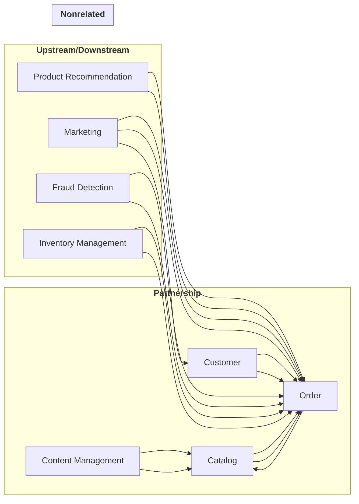

A bounded context is a concept from Domain-Driven Design that establishes boundary within a domain and contains models related to that context. The concepts, [entities](./entity), [value objects](./value-object), and [aggregates](./aggregate-pattern) within the bounded context are written using a [ubiquitous language](./ubiquitous-language). This language is also used in things such as documentation for the project and spoken throughout meetings on the project.

A domain may have multiple bounded contexts within its environment. Each bounded context may be maintained by a team. [Context Mapping](./context-mapping) is used to help explain the relationships between two bounded contexts as well as indicate the relationship needed between the teams that maintain those two contexts.

## eCommerce example of bounded contexts

This is an example of a context map showing bounded contexts that may be in an eCommerce system and how they interact.

The bounded contexts include:

- Catalog
- Content Management
- Customer
- Fraud Detection
- Inventory Management
- Marketing
- Order
- Product Recommendation

## References

- [Domain analysis for microservices - Azure Architecture Center](https://learn.microsoft.com/en-us/azure/architecture/microservices/model/domain-analysis)
- [Martin Fowler's Bliki: BoundedContext](https://martinfowler.com/bliki/BoundedContext.html)
- [Bounded Contexts - Eric Evans - DDD Europe 2020](https://www.youtube.com/watch?v=am-HXycfalo)
- [DDD Reference - Domain Language](https://www.domainlanguage.com/ddd/reference/)