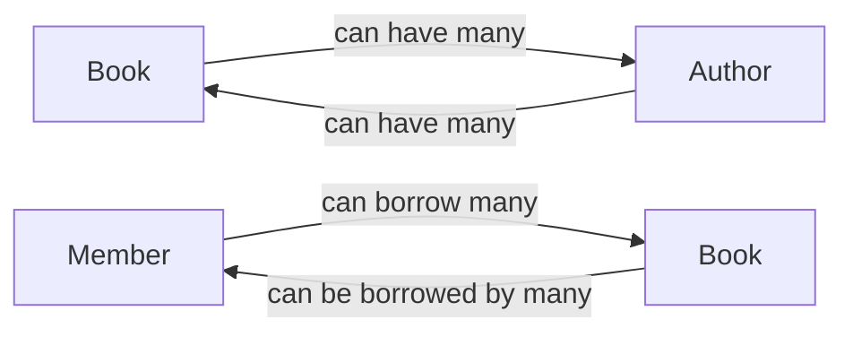

A **domain model** in DDD is a conceptual representation of the core concepts, entities, and relationships within a specific domain. It serves as a shared understanding between domain experts and developers, facilitating communication and collaboration. The domain model is a living document and should continuously evolve as your understanding of the domain grows.

## Domain Modeling

The evolution of a domain model happens in 2 phases: [strategic design](/domain-driven-development/strategic-design) and [tactical design](/domain-driven-development/tactical-design).

Think of strategic design as building the blueprint of your domain model. Conversations are had to help build a conceptual domain model. Tactical design is the implementation of the blueprint, including all the details that fill the conceptual domain model.

While strategic design is often collaborative and involves domain experts, tactical design typically falls to developers and architects.

Both phases are iterative and should be continuously refined as you learn more about your domain.

## Sample Domain Model

In this example, we're going to use a library management system.

### Strategic Phase

In the strategic phases, conversations are had and entities, relations, and ubiquitous language start to appear.

Entities that are discovered during those conversations could include `Book`, `Author`, and `Member`.



Through conversation you may learn that:
- A book can have many authors.
- An author can write many books.
- A member can checkout many books.
- A book can be borrowed by many members.

The ubiquitous language may start to develop with terms such as:
- Borrow
- Return
- Reserve
- Loan
- Overdue

Bounded contexts may be discovered through [EventStorming](/domain-driven-design/eventstorming). These contexts may include:
- Catalog management
- Member management
- Inventory management

The documentation for the domain model at this phase may include diagrams, charts, glossary, and context map.

### Tactical Phase

In the tactical phase, you would get into the implementation details of the conceptual domain. This is where you identify entities, value objects, and aggregates within the bounded contexts. Domain services also are developed.

The following C# code contains entities, value objects, and aggregates. Notice that:

- Entities inherit from an `EntityBase` class.
- Value objects inherit from a `ValueObject` class.
- Aggregates implement an `IAggregateRoot` interface.

You can learn more about these classes and interfaces in [Ardalis.SharedKernel](https://github.com/ardalis/Ardalis.SharedKernel/).

```csharp
// Book (Catalog Management)
public class Book : EntityBase
{
    public String Title { get; private set; }
    public Author Author { get; private set; }
    public ISBN ISBN { get; private set; }
    public DateTime PublicationDate { get; private set; }
    // ... other properties and methods
}

// Author (Catalog Management)
public class Author : EntityBase
{
    public Name Name { get; private set; }
    // ... other properties and methods
}

// ISBN (Catalog Management)
public class ISBN : ValueObject
{
    public string Value { get; private set; }
    // ... validation and conversion logic
}

// Member (Member Management)
public class Member : EntityBase
{
    public Name Name { get; private set; }
    public MembershipType Type { get; private set; }
    // ... other properties and methods
}

// MembershipType (Member Management)
public enum MembershipType
{
    Standard,
    Premium
}

// Loan (Loan Management)
public class Loan : IAggregateRoot
{
    public Book Book { get; private set; }
    public Member Member { get; private set; }
    public DateTime BorrowedDate { get; private set; }
    public DateTime? ReturnedDate { get; private set; }
    public BorrowingPeriod LoanPeriod { get; private set; }
    // ... domain logic for borrowing and returning books
}

// BorrowingPeriod (Loan Management)
public class BorrowingPeriod : ValueObject
{
    public int Days { get; private set; }
    // ... validation and calculation logic
}

```