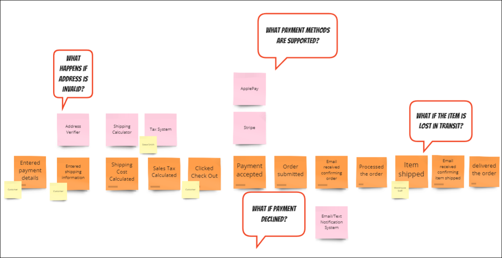

EventStorming is a powerful and collaborative workshop-based technique that enables teams to gain a deeper understanding of complex business domains, leading to more effective software development. The participants in this workshop are representatives across the business such as stakeholders, IT professionals, developers, domain experts, business analysts, designers, and anyone else relevant to the domain.

Simplified EventStorming example for eCommerce

## General Overview

Some of the pains of software development come down to communication issues. Silos, project managers who are the mediator between tech and the business, and a disjointed language between teams all lead to communication pains. EventStorming can help cross these pain points, as it brings together everybody - the people who are experts behind the domain and the people who need to learn more about the domain - in the same room. A **facilitator** - best as an outsider immune to company politics - gets conversations happening, asks the questions people may be afraid to ask, and moves the group as they are building the collective timeline of a domain, process, or other exploratory situation.

Before an EventStorming workshop happens, the facilitator will try to invite all of the relevant people to help solve a business problem. During the workshop, the facilitator will guide the participants through different phases of discussion and discovery. Depending on the needs and the time available, the group may explore events, commands, roles, policies, external systems, value streams, opportunities, concerns, and other things that provide a wider understanding of a domain.

The pattern of the EventStorming workshop goes like this:

- Everyone comes together to discuss what domain they are exploring.
- The facilitator sends them off to start creating events individually. This is where mindsets **diverge**.
- As they go through adding events and other pieces of the puzzle, new insights **emerge**.
- At the end, the group **converges** on a potential solution, take-aways, and next steps.

## Types of EventStorming

There are many scenarios where EventStorming can be used. Some types of EventStorming include:

- **Big Picture EventStorming** - the goal to explore a domain, typically at a high level
- **EventStorming for Process Modeling** - explore a specific process
- **EventStorming for Software Design** - explore a technical solution
- **EventStorming for People Experience** - explore the domain or a process with a focus on the experience of someone going through the process or domain. Experience examples include user experience, customer experience, or developer experience
- **EventStorming as a Retrospective** - getting the perspectives of all involved to get a better understanding of what happened - can be carried forward for improvements for a process that repeats. For example, conference planners could use EventStorming to see how everything played out for their conference and can make note of the pain points. In this case, commands might be skipped. Events, roles, and external systems would still be a part of the discussion.

## How EventStorming Works

There are many steps to understanding the events within a domain.

1. Set the goals for the EventStorming session.
2. Determine the mode for the workshop. This may be done in-person with long rolls of paper, sticky notes, and markers. This can also be done in a virtual environment with a digital whiteboard and digital stickies. The more room to work, the better to stretch out, give ample room to the timeline, and give people room to talk about the events while in front of their stickies.
3. Have everyone involved take stickies and create events that occur within the domain. Use *orange sticky notes* to represent events.
4. Identify **pivotal events** or **key timeline points** to make it easier to order the rest of the events.
5. Draw in a timeline using an arrow to indicate direction. Then, order the events chronologically. If multiple events happen at the same time, it is fine to stack them to show they are running in parallel.
6. Add in **roles** - entities that trigger the events. Use *small yellow sticky notes* for actors or roles.
7. Add **commands** - actions triggered by events. Use *blue sticky notes* for commands.
8. As discussion happens, add more commands and events as needed, keeping them ordered chronologically.
9. Make note of outstanding questions, pain points and bottlenecks. Capture those with *red sticky notes*.

### Other Stickies for EventStorming

There are other stickies that may be used to represent other parts of the cycle. These include:

- **Business Process** or **Business Logic** are represented by *purple sticky notes*. Examples here include billing policies.
- **External systems** or **third-party systems** are represented by *pink sticky notes*. Systems could include things such as tax calculation systems, payment processors, and delivery systems.
- **Views** or **read models** - such as inventory lists, order lists, and invoice lists - are represented with *green sticky notes*.

## Benefits of EventStorming

These are some of the benefits of EventStorming:

- Develops a [ubiquitous language](./ubiquitous-language)
- Facilitates [communication](/values/communication) between teams
  - By building up better communication channels between teams, this could lead to better morale when these teams collaborate in the future. Software development works better as a [whole team activity](/practices/whole-team-activity).
- Visualizes shared understanding - This is also great for onboarding new people to the domain and having them learn from the shared understanding.

## References

- [EventStorming.com](https://www.eventstorming.com/).
- [Alberto Brandolini - 50,000 Orange Stickies Later - Explore DDD 2017](https://www.youtube.com/watch?v=1i6QYvYhlYQ)
- [Slides for "50,000 Orange Stickies later"](https://www.slideshare.net/ziobrando/50000-orange-stickies-later)
- [YOW! 2016 Paul Rayner - EventStorming - Collaborative Learning for Complex Domains](https://www.youtube.com/watch?v=04tGbixfGEY)