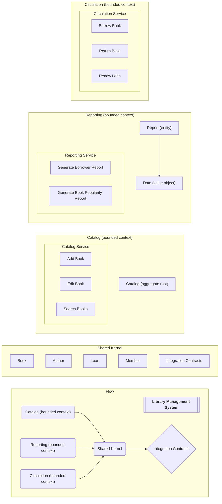

In DDD, a Shared Kernel is a special type of Bounded Context that contains code and data shared across multiple bounded contexts within the same domain. It acts as a central repository for ubiquitous language elements, domain logic, and data structures that are common to all or a subset of the bounded contexts.

## Elements of a Shared Kernel

These are elements of a shared kernel:

- [Ubiquitous Language](/domain-driven-design/ubiquitous-language): This includes common terms, concepts, and vocabulary used to describe the domain across all bounded contexts.
- [Domain Models](/domain-driven-design/domain-model): This encompasses core entities, value objects, and other domain objects representing essential domain concepts.
- **Domain Logic**: This includes business rules, validations, and algorithms that are shared across multiple contexts.
- **Data Structures**: This includes common data structures like entities, enums, data transfer objects (DTOs), and domain events.
- **Integration Contracts**: These define the interfaces for communication and data exchange between bounded contexts.
- **Infrastructure Components**: In some cases, shared libraries or framework components used by multiple contexts might be included.

## An Example of a Shared Kernel

These are subdomains that may be seen in a Library Management System domain:
- Reporting
- Catalog
- Circulation

For this example, we are treating each of the subdomains as separate bounded contexts.

Let's take a look at these components.

These are some of the entities and value objects that may be found in a library managment system's shared kernel since they could be referred to in multiple bounded contexts:

  - Book: Represents a book with attributes like title, author, and publication date.
  - Author: Represents an author with attributes like name and biography.
  - Loan: Represents a loan with attributes like borrowed date, due date, and borrower.
  - Member: Represents a member with attributes like name, contact information, and membership type.
  - Report: Represents a report with attributes like title, date generated, and data.
  - Date (value object): Represents a date with attributes like year, month, and day. This could be used for the report date.

  
## Benefits of a Shared Kernel

These are some benefits of having a shared kernel:

- **Reduced Duplication**: Eliminates the need to duplicate common domain logic and data structures in each bounded context.
- **Improved Consistency**: Ensures consistent terminology and domain concepts across all contexts.
- **Simplified Communication**: Facilitates communication and collaboration between teams working on different bounded contexts.
- **Unified Domain View**: Provides a central location for understanding the core domain concepts.

## Challenges of a Shared Kernel

These are some challenges of working with a shared kernel:

- **Tight Coupling**: Changes in the shared kernel can impact all dependent contexts, potentially introducing regressions.
- **Complexity Management**: Maintaining and evolving a shared kernel can be complex, especially when multiple teams contribute.
- **Overhead of Synchronization**: Requires a robust and coordinated approach to synchronize changes across dependent contexts.
- **Performance Considerations**: Shared components might introduce performance bottlenecks if not carefully designed and implemented.

## When to use a Shared Kernel

These are times when you should use a shared kernel:

- When you have multiple bounded contexts within the same domain that share significant domain logic and data.
- When maintaining consistency of domain concepts across contexts is crucial. In this case, duplication would be a hindrance.
- When you have limited resources and want to avoid duplication of effort.

## Alternatives to a Shared Kernel

Sometimes, a shared kernel may not make sense for your team. Choosing the right approach depends on the specific needs and complexities of your domain and your development team.

These are some alternatives to a shared kernel:

- **Duplication**: Each bounded context can duplicate the necessary domain logic and data.
- [Anti-Corruption Layer](/domain-driven-design/anti-corruption-layer): Each context can adapt the shared kernel's data and logic to its specific needs.
- **Event-driven Integration**: Bounded contexts can communicate and synchronize data using asynchronous events.

## Additional Resources

- [ASP.NET Core Clean Architecture Template version 8](https://ardalis.com/aspnetcore-clean-architecture-template-version-8/)
- [Ardalis.SharedKernel](https://github.com/ardalis/Ardalis.SharedKernel)