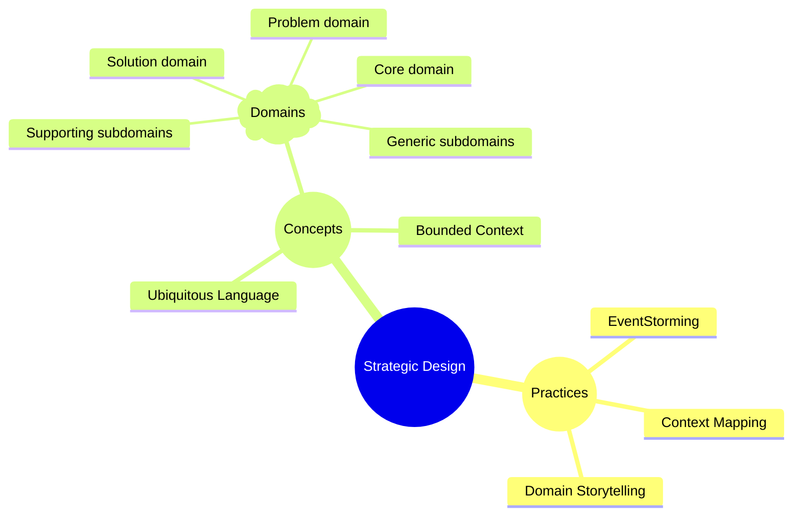
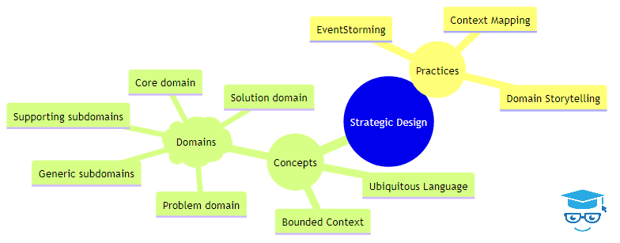

<!-- 

-->

In DDD, there are 2 phases for modeling the domain - strategic design and tactical design. **Strategic Design** starts the domain modeling with the high-level overview of the domain. Strategic design is essential for establishing a solid foundation for your domain model in DDD.

## Goals of Strategic Design

When looking at the domain from a high-level overview, strategic design comes with the following goals:

- Build a shared understanding of core concepts, entities, and relationships with the domain.
- Define bounded contexts and ther interactions.
- Establish a ubiquitous language that is shared by technical and non-technical communication.

## Activities that Happen During Strategic Design

In the strategic design phase of Domain-Driven Design (DDD), several techniques can be employed to gain a deep understanding of the domain and build a solid foundation for your domain model. These techniques include:

- [Domain Storytelling](/domain-design-patterns/domain-storytelling) - get knowledge from domain experts and stakeholders through storytelling 
- [EventStorming](/domain-design-patterns/eventstorming) - collaboratively model the domain by focusing on events and their consequences
- [Context Mapping](/domain-design-patterns/context-mapping) - visualize the relationships and dependencies between different bounded contexts

Each of these techniques gathers details about a domain to build a conceptual domain model.

When it comes to these particular activities, this is a suggested order in incorporating them into the strategic design phase.

1. **Start with Domain Storytelling.** This helps build a shared understanding of the domain and identify key concepts.
2. **Use EventStorming to refine the domain model.** The stories in domain storytelling can help shape the start of the domain model. EventStorming takes it further by visualizing the domain dynamics, identifying bounded contexts, and uncovering potential issues.
3. **Apply Context Mapping to define the relationships between contexts.** EventStorming can be used to identify the bounded contexts. This helps design a microservices architecture or a modular monolith environment. Context maps allow us to plan for communication and collaboration between contexts.
   
By using these techniques in conjunction with other strategic design activities like ubiquitous language development, you can establish a strong foundation for your DDD project and ensure a successful implementation.

## Artifacts from Strategic Design

During strategic design, you will create the following artifacts:

- Conceptual domain model
- Bounded context map
- Ubiquitous language glossary
- 
## Learn More

- [On-Demand Webinar: Intro to Domain-Driven Design with C#](https://mailchi.mp/nimblepros/af2112un73)
- [On-Demand Webinar: Domain Storytelling](https://mailchi.mp/nimblepros/domain-storytelling)
- [On-Demand Webinar: From Chaos to Clarity: How EventStorming Streamlines Complex Domains](https://mailchi.mp/nimblepros/eventstorming-recording)]
- [Email Course: Intro to DDD](https://mailchi.mp/nimblepros/intro-to-ddd-email-course)