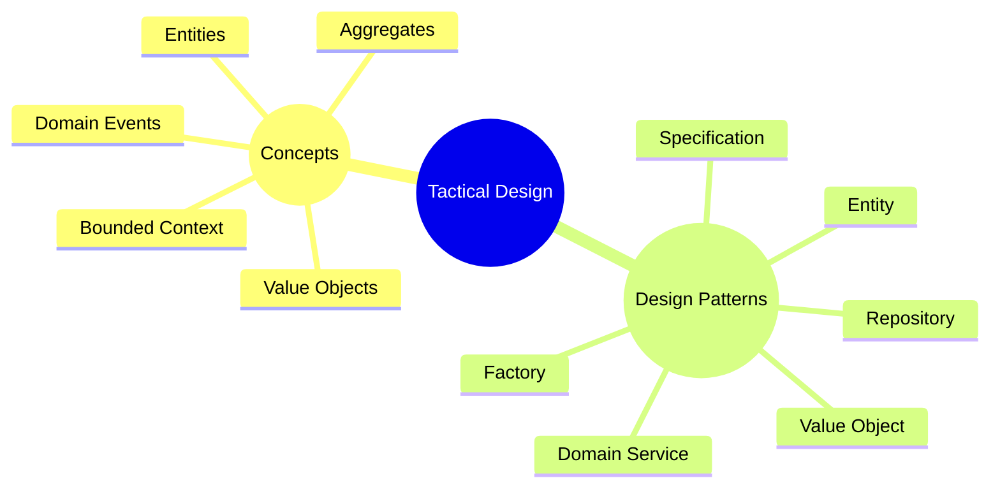

In DDD, there are 2 phases for modeling the domain - strategic design and tactical design. **Tactical Design** starts with the conceptual domain model from the strategic phase and gets into the low-level implementation details. It takes the concept and makes it concrete.

## Goals of Tactical Design

These are the goals of the tactical design phase:

- Translate the strategic design into concrete classes, interfaces, and modules.
- Apply tactical design patterns to optimize the domain model.
- Ensure the domain model is efficiently implemented.

## Activities that Happen During Tactical Design

As the tactical design gets into the implementation of the strategic design, the activities will get more into the code. Activities that happen in the tactical design phase include:

- Designing entities and value objects
- Identifying aggregates
- Defining domain services
- Implementing specification and validation details

## Artifacts from Tactical Design

In the tactical design phase of domain modeling, the following artifacts are generated:

- Implemented domain model
- Code for the system