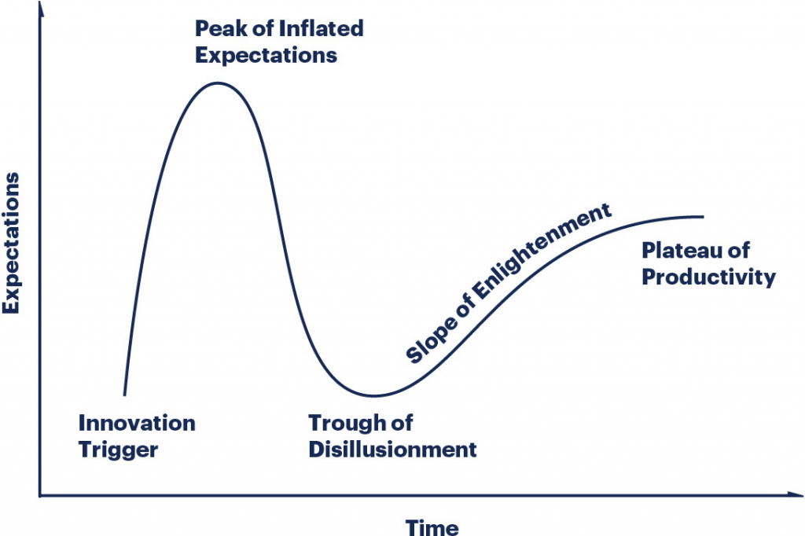

*“We tend to overestimate the effect of a technology in the short run and underestimate the effect in the long run.”* - Roy Amara

This article gives an overview of Amara's Law, exploring its history and implications for technological predictions. Let's dive right in!

## Table of Contents

1. [What is Amara's Law?](#what-is-amaras-law)
2. [Amara's Law in Action](#amaras-law-in-action)
3. [Hype Cycles in Technology](#hype-cycles-in-technology)
4. [Applying Amara's Law](#applying-amaras-law)

## What is Amara's Law?

Amara's Law is an observation made by futurologist Roy Amara, stating that people tend to overestimate the short-term impact of new technologies while underestimating their long-term effects. This law serves as a reminder to consider the broader context and timeline when predicting technological advancements.

## Amara's Law in Action

Here are a few examples of technologies where Amara's Law has been evident:

1. **The Internet**: In the early days, many people didn't grasp the full potential of the internet. Today, it has revolutionized communication, business, and almost every aspect of our lives.
2. **Artificial Intelligence (AI)**: Initial excitement about AI in the 1960s led to disappointment as it failed to deliver on its promises. However, recent advancements have shown AI's potential to transform industries and our daily lives.
3. **Electric Vehicles (EVs)**: Early adoption of EVs was slow, and many doubted their feasibility. Today, they are becoming mainstream as the technology advances and environmental concerns grow.

## Hype Cycles in Technology

The Gartner Hype Cycle is a graphical representation of the hype and subsequent disappointment associated with new technologies, often influenced by Amara's Law.

It consists of five stages:

1. **Innovation Trigger**: A new technology is introduced, sparking interest.
2. **Peak of Inflated Expectations**: Early publicity generates over-enthusiasm, and unrealistic expectations emerge.
3. **Trough of Disillusionment**: The technology fails to meet expectations, and disillusionment sets in.
4. **Slope of Enlightenment**: More practical applications are discovered, and the technology's potential becomes clearer.
5. **Plateau of Productivity**: The technology becomes widely adopted and its true value is recognized.

## Applying Amara's Law

Here are a few suggestions for applying Amara's Law in your personal or professional life:

1. **Be patient**: Don't get swept away by hype. Instead, focus on the long-term potential of a technology.
2. **Stay informed**: Regularly update your knowledge and understanding of technological advancements to make better decisions.
3. **Embrace change**: Adopt a mindset of continuous learning and adaptation to stay ahead in the ever-changing world of technology.
4. **Think critically**: Evaluate new technologies based on their potential long-term impact, rather than just their immediate applications.

In conclusion, Amara's Law reminds us of the importance of taking a long-term perspective when assessing new technologies. By staying informed, patient, and critical, we can better navigate the world of technology and make wiser decisions for our future.

## Further Reading

1. [Roy Amara - Wikipedia](https://en.wikipedia.org/wiki/Roy_Amara)
2. [Gartner Hype Cycle - Gartner Inc.](https://www.gartner.com/en/research/methodologies/gartner-hype-cycle)
3. [The History of the Internet - Internet Society](https://www.internetsociety.org/internet/history-internet/)
4. [A Brief History of AI - Association for Computing Machinery (ACM)](https://www.acm.org/publications/computing-surveys/articles/a-brief-history-of-ai)
5. [Electric Vehicles: A Brief History - US Department of Energy](https://www.energy.gov/timeline/timeline-history-electric-car)
