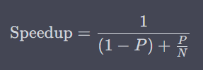

Amdahl's Law is one of the pillars in the realm of computer science, specifically in the area of parallel computing. Named after Gene Amdahl, an American computer architect and high-tech entrepreneur, this law provides insights into the potential speedup that can be achieved when using multiple processors. The law sets a theoretical limit on how far you can go with parallelization.

## What is Amdahl's Law

Amdahl's Law gives us a formula to calculate the maximum improvement achievable by parallelizing a part of a given system. The law focuses on the relationship between:

- The fraction of the application that can be parallelized (`P`)
- The fraction that cannot be parallelized (`(1 - P)`)
- The number of processors (`N`)

The formula for Amdahl's Law is as follows:

## Practical Implications

Understanding Amdahl's Law has essential practical implications for both software architects and developers. When you're scaling your application horizontally (i.e., adding more machines) or vertically (i.e., adding more cores to a machine), you need to be aware of the limits set by Amdahl's Law. No matter how many resources you throw at a problem, there's a theoretical ceiling on the speedup you can achieve.

## Use-Cases

- **Cloud Computing:** When auto-scaling in the cloud, knowing the limitations of Amdahl's Law can help you make informed decisions about how many resources to allocate.
- **Big Data:** For large data processing tasks, understanding Amdahl's Law can help you optimize your algorithms for maximum efficiency.
- **High-Performance Computing (HPC):** Amdahl's Law is crucial for HPC applications where understanding the bottleneck can make or break your performance targets.

## Mitigating Amdahl's Law

- **Divide and Conquer:** Break down tasks into smaller chunks that can be parallelized efficiently.
- **Optimize the Sequential Part:** Improve the performance of the portion that can't be parallelized.
- **Asymptotic Behavior:** Sometimes, as the problem size grows, the parallelizable part may tend to dominate, mitigating the effects of Amdahl's Law to some extent.

## Conclusion

Amdahl's Law serves as a reality check for those looking to improve system performance through parallelization. It should never be underestimated when planning your system architecture.

## References

- [Amdahl, Gene. "Validity of the Single Processor Approach to Achieving Large Scale Computing Capabilities."](https://dl.acm.org/doi/10.1145/1465482.1465560)
- [Barney, Blaise. "Introduction to Parallel Computing." Lawrence Livermore National Laboratory.](https://computing.llnl.gov/tutorials/parallel_comp/)
- [Asanovic, Krste et al. "The Landscape of Parallel Computing Research: A View from Berkeley."](https://www2.eecs.berkeley.edu/Pubs/TechRpts/2006/EECS-2006-183.pdf)
- [Dongarra, Jack et al. "Introduction to High Performance Computing for Scientists and Engineers."](https://www.crcpress.com/Introduction-to-High-Performance-Computing-for-Scientists-and-Engineers/Griebel-Schweitzer/p/book/9781439811924)