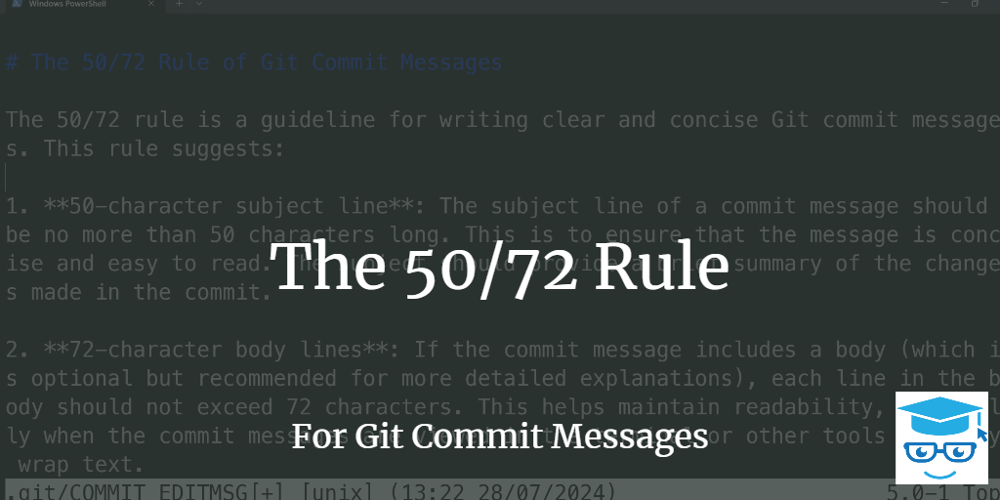
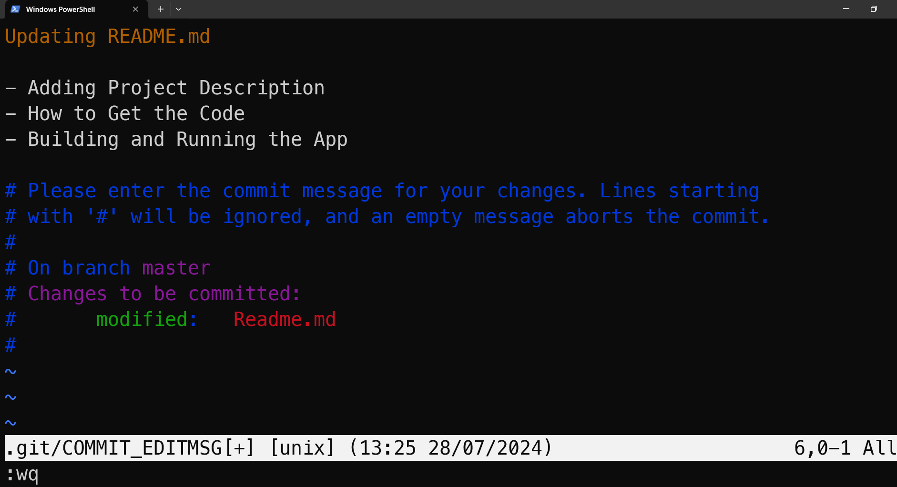

The 50/72 rule is a guideline for writing clear and concise Git commit messages. This rule suggests:

1. **50-character subject line**: The subject line of a commit message should be no more than 50 characters long. This is to ensure that the message is concise and easy to read. The subject should provide a brief summary of the changes made in the commit.

2. **72-character body lines**: If the commit message includes a body (which is optional but recommended for more detailed explanations), each line in the body should not exceed 72 characters. This helps maintain readability, especially when the commit messages are viewed in the terminal or other tools that may wrap text.

## Why is the 50/72 Rule Useful?

- **Clarity**: Keeping the subject line to 50 characters forces the author to summarize the changes succinctly, making it easier for others to understand the main purpose of the commit at a glance.
  
- **Readability**: The 72-character limit for body lines ensures that the message is easy to read in various interfaces, including terminals and web-based Git repositories, without awkward line breaks.

- **Consistency**: Following a standardized format for commit messages helps maintain a consistent history, making it easier to navigate and understand the project's evolution.

## Example of a Well-Formatted Commit Message

```text
Add user authentication feature

- Implemented user login functionality
- Added password hashing using bcrypt
- Integrated user session management
- Updated tests to cover new authentication logic

This commit introduces a new user authentication feature, allowing
users to securely log in and manage their sessions. The changes
include implementing the backend logic for handling user credentials,
encrypting passwords, and maintaining session data. Additionally,
tests have been updated to ensure the new functionality is properly
covered.
```

In this example:

- The subject line is a concise summary of the changes.
- The subject line should have no more than 50 characters.
- The subject line is separated from the body by a blank line.
- The body provides a more detailed explanation of the changes and their impact, with each line kept within 72 characters.

Unrelated to the 50/72 Rule, it's also often useful to reference the work item, ticket, or GitHub issue the commit references or fixes.

## Writing Multiline Commit Messages in a Terminal

While most IDEs support git commits and messages using the above formatting (and often provide a mechanism for separate subject and body lines automatically), many developers prefer to use the command line interface (CLI). In the CLI, you can format multi-line commit messages by using multiple "-m" switches on the `git commit` command. Alternately, if you simply write `git commit` with no further switches, the default editor will open, and you can compose a (multi-line) commit message there. In many cases this editor will be **vi** or **vim** so you may need to know a few commands like typing "i" to enter "insert" mode and then, when you're done, pressing ESC to enter command mode and finally ":wq" to write your changes and quit the editor.

You can see an example of this on Windows using Powershell in the image below:



## References

- [How to Write a Git Commit Message](https://tbaggery.com/2008/04/19/a-note-about-git-commit-messages.html)
- [Git Commit Message Guidelines](https://chris.beams.io/posts/git-commit/)
- [Git 50/72: the rule of well formed Git commit messages](https://www.midori-global.com/blog/2018/04/02/git-50-72-rule)- [Code That Fits in Your Head (Mark Seeman)](https://amzn.to/3xTL8NO)
