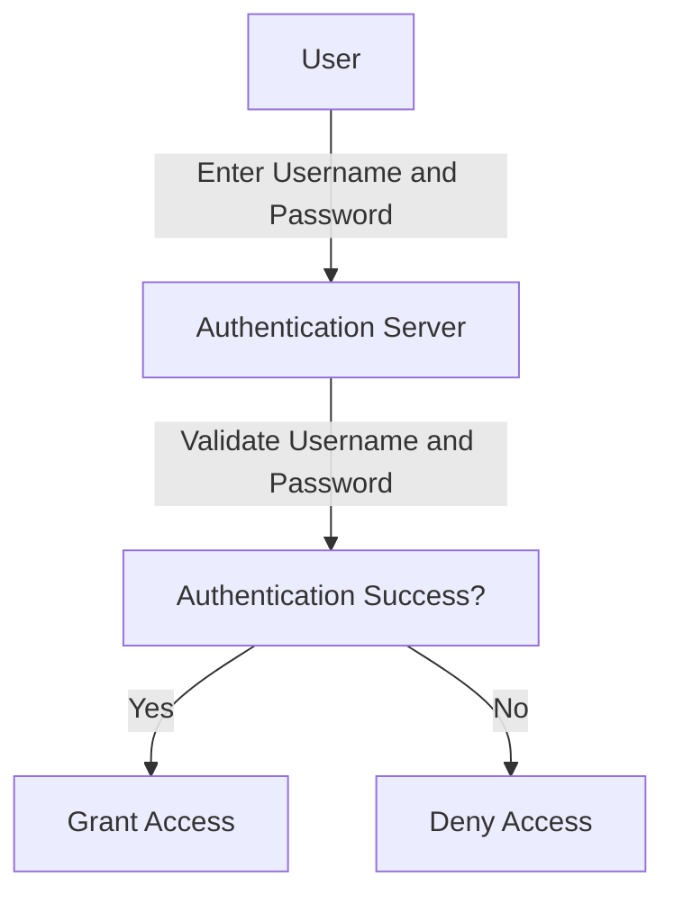
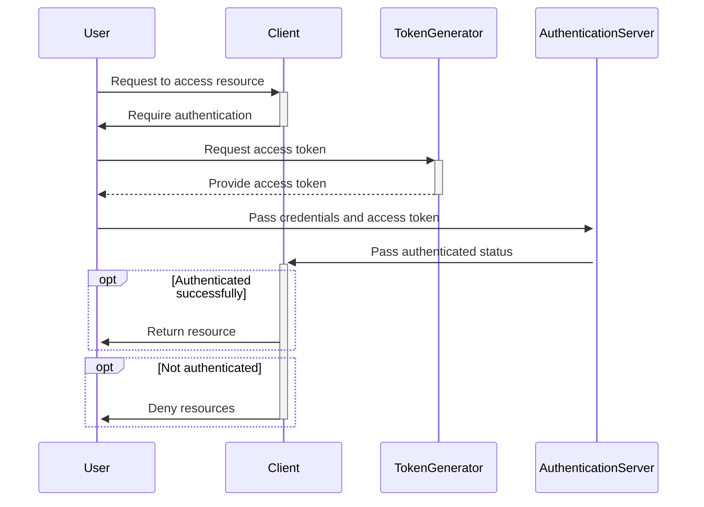

"Are you who you claim to be?" This is the main concept of **authentication** - ensuring that a user, system, or entity is truly who they claim to be.

## Authentication vs Authorization

When working with security, authentication gets mixed up with authorization. Think of it this way:

- **Authentication (AuthN)**: "Are you who you claim to be?"  If you are truly who you claim to be, then you are authenticated. However, if you don't make it through the authentication process, then there's no guarantee that you are truly who you claim to be.
- **Authorization (AuthZ)**: "Do you have permission to do what you're trying to do?" If you have the permission to what you are trying to do, you are authorized to take that action. Otherwise, you may be unauthorized for many reasons - implicitly or explicitly. For example, you may be unauthorized implicitly by not having a permission assigned to you. However, you may be unauthorized explicitly if you have a permission denied to you.

## Forms of Authentication

For in-person authentication, you may have to show some kind of photo ID, driver's license, passport, or other form of identification that can help someone ensure they are really dealing with who you claim to be.

When it comes to digital authentication, there are many forms of authentication, including:

- password-based authentication
- token-based authentication
- certificate-based authentication
- biometric authentication

### Password-based authentication

**Password-based authentication** is the most basic methods of authentication that involves a user name or email address and a password. There are many downfalls to password-based authentication - including weak passwords, password reuse, and password theft. With the rise of **password fatigue** - the stress and exhaustion users feel by the excessive numbers of passwords they have to maintain with varying complex rules, password reuse continues to cause problems. With insecure password management - such as storing the passwords in plain-text in an unencrypted file or even something as basic as writing a password on a sticky note, password theft continues to be easy to achieve.

### Token-based authentication

**Token-based authentication** involves using a physical device or application that generates a **one-time password** (OTP). Common token generators include key fobs and authenticator apps - such as Microsoft Authenticator and Google Authenticator. Some password managers also have the ability to generate these OTP tokens.

### Certificate-based authentication

**Certificate-based authentication** involves using digital certificates to authenticate the identity of a user or system. These certificates are issued by a trusted Certificate Authority (CA). 

Certificate-based authentication relies on a pair of keys for encryption - **cryptographic keys** - known as a private key and a public key. These keys are generated during certificate creation. When a certificate is created, it includes the public key as well as other information to about the entity. The certificate is signed by the CA using its own private key to create a digital signature.

The entity using the certificate can present the certificate when prompted for certificate-based authentication. The receiving end can use the CA's public key to ensure that the digital certificate is valid and not tampered with.

A common certificate used in certificate-based authentication is the **X.509 certificate**.

### Biometric Authentication

Biometric authentication involves physical or behavior characteristics of an individual - such as facial recognition, voice recognition, iris scans, and fingerprints. Since these are specifically tied to the individual's physical being, these are more secure than the traditional password-based authentication.

## Multi-Factor Authentication

Since password-based authentication is common yet susceptible to compromise, there is a rise in requiring 2-factor authentication (2FA) or multi-factor authentication (MFA).

2FA and MFA typically start with password-based authentication. From there, they require at least one more factor for authentication. The factors used in 2FA and MFA are:

- Knowledge factor - Something you know
- Possession factor - Something you have
- Inherence factor - Something you are

### Knowledge factors

**Knowledge factors** are things you know. These include things such as passwords, PINs, and answers to security questions.

### Possession factors

**Possession factors** are things you have. These include token generators used in token-based authentication and certificates used in certificate-based authentication.

### Inherence factors

**Inherence factors** are things that you are. These include the things needed for biometric authentication - fingerprints, eyes, faces, and voices.

## Conclusion

Remember - authentication comes back to the question of "Are you really who you claim to be?"

## References

- [Learn about Windows Hello and set it up](https://support.microsoft.com/en-us/windows/learn-about-windows-hello-and-set-it-up-dae28983-8242-bb2a-d3d1-87c9d265a5f0)
- [Biometrics in Android](https://source.android.com/docs/security/features/biometric)
- [About Face ID advanced technology](https://support.apple.com/en-us/102381)