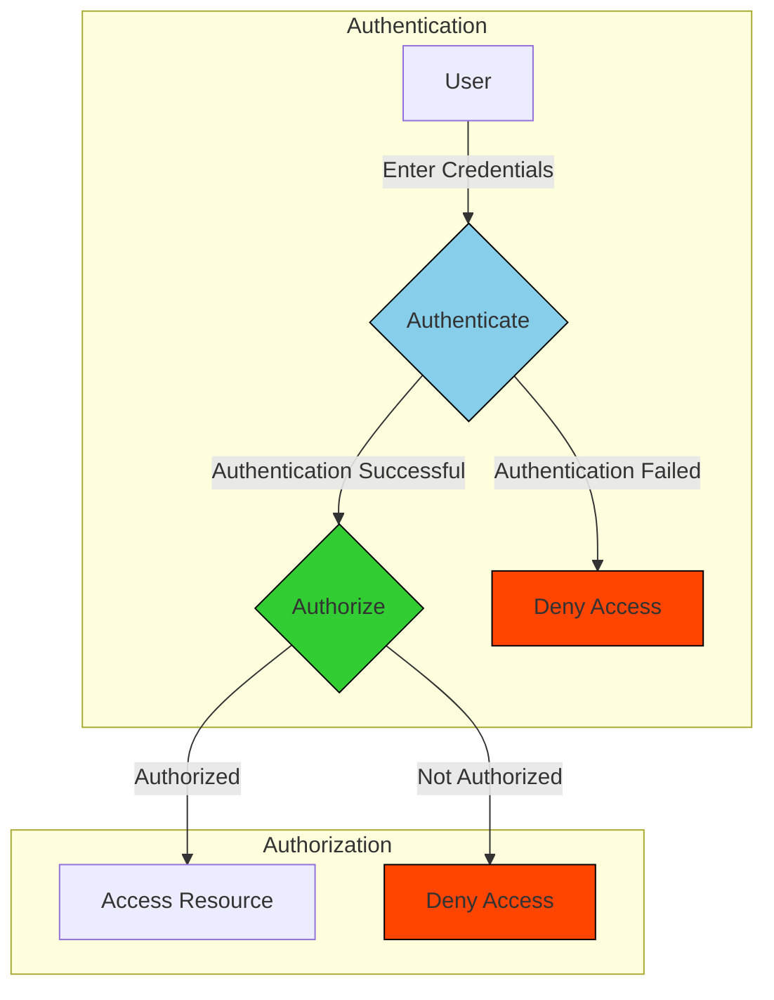

"Do you have the permission to do what you are trying to do?" This is the main concept of **authorization** - ensuring that an entity has permissions to perform an action.

## Authentication vs Authorization

When working with security, authentication gets mixed up with authorization. Think of it this way:

- **Authentication (AuthN)**: "Are you who you claim to be?"  If you are truly who you claim to be, then you are authenticated. However, if you don't make it through the authentication process, then there's no guarantee that you are truly who you claim to be.
- **Authorization (AuthZ)**: "Do you have permission to do what you're trying to do?" If you have the permission to what you are trying to do, you are authorized to take that action. Otherwise, you may be unauthorized for many reasons - implicitly or explicitly. For example, you may be unauthorized implicitly by not having a permission assigned to you. However, you may be unauthorized explicitly if you have a permission denied to you.

## Authorization Process

Authorization is used to check whether an entity has access to perform an action - such as accessing a resource, updating a record, or deleting a resource.

Authorization does not require authentication. Anonymous access to resources may be allowed by a system. So an **anonymous authorization check** happens when there isn't an authenticated user and that user is trying to perform an action.

Commonly, resources and actions may be restricted to authenticated users. The practice of authorization follows the practice of authentication. The graph below shows the process of trying to access a resource that requires an authenticated account:

## Authorization and HTTP Status Codes

A common application of authorization is in API access. The client error responses (400-499) include responses related to authorization.

- **401 - Not Authorized**: Despite its name, this indicates that the identity is unauthenticated.
- **403 - Forbidden**: In this case, the identity is authenticated and is denied access to the action.

## Conclusion

Remember that authorization comes back to the question "Do you have the permission to do what you are trying to do?"

## References

- [HTTP Response Status Codes (MDN Web Docs)](https://developer.mozilla.org/en-US/docs/Web/HTTP/Status)