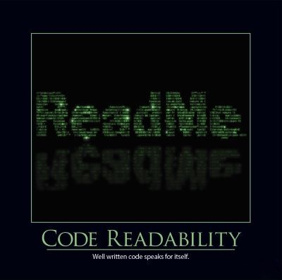

Writing code that is readable is critical for any software application that needs to be maintained for any length of time.  There are valid performance and anti-theft reasons to [minify](http://en.wikipedia.org/wiki/Minification_(programming)) or even [obfuscate](http://en.wikipedia.org/wiki/Obfuscation_(software)) code that is being deployed, but the source with which the team works should be kept in as readable and well-organized a state as possible. Code that is well written for human understanding should generally be readable by an experienced developer with little need for external documentation (except perhaps at a high level) or code comments (except to explain why certain design decisions were made).

There are many practices that reduce code readability.  Poor variable names, especially short, cryptic names, can make it difficult to know the purpose of a variable.  Long classes and long methods are much harder to follow than short ones, and often end up with a lot of conditional complexity that can take some effort to understand.  Consistent coding conventions, not just for variable naming but also casing (pascal, camel, etc.) of elements, indentation and line break styles, etc. can also have an impact on how easy it is to quickly understand what a program is doing.

Ideally your functions should do one thing, their name should reflect what they're doing, and they should live in a class that is small and cohesive for the behavior the function encapsulates.  Short functions within small classes are generally easy to understand, provided there is actual behavior going on in these functions.  Taken too far, this approach can lead to a situation in which every function seems to call out to some other small function, perhaps in another class, and one has to chase the thread of execution through half a dozen classes to see what a simple method actually does.  However, when used in moderation, well-named functions that can be read without scrolling provide the ideal level of code readability.

## Quotes

Any fool can write code that a computer can understand.  Good programmers write code that humans can understand. -- Martin Fowler

Programs should be written for people to read, and only incidentally for machines to execute. --[Abelson and Sussman](http://amzn.to/110fANn)

## References

2013 Software Craftsmanship Calendar (look closely for hints in the image; the code runs and produces a secret message)
