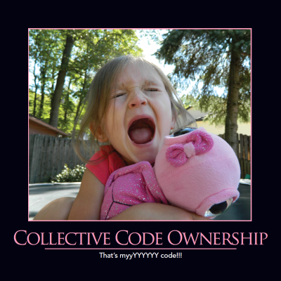

Collective code ownership breaks down fiefdoms within an application's codebase. Nobody "owns" a particular part of the code. Everyone on the team is responsible for all of the code.  This enables [pair programming](/practices/pair-programming/) and [refactoring](/practices/refactoring/) by the [whole team](/practices/whole-team/). It also reduces the project's [bus factor](/terms/bus-factor/).

This goes against traditional, cynical, job security advice. Writing cryptic code that only you can understand would seem to make you difficult to replace, improving job security. However such practices are detrimental to the project and the team, and developers who are able to work effectively in teams and who can deliver quality results will always be more in demand than those whose code is obtuse and difficult to understand for the sake of being difficult (or clever).

Collective code ownership means the team applies their coding standards consistently. [Names](/practices/naming-things/) are chosen that make sense to everybody on the team. Things that are clever or cryptic are replaced by things that are simple and well understood. The result is [readable code](/practices/code-readability) the whole team can work on, and code that is better for having been reviewed by multiple sets of eyes.

## See Also

[Naming Things](/practices/naming-things)

[Keep It Simple](/principles/keep-it-simple/)

[Code Readability](/practices/code-readability/)

## References

[Collective Ownership](http://www.extremeprogramming.org/rules/collective.html)

2016 Software Craftsmanship Calendar
