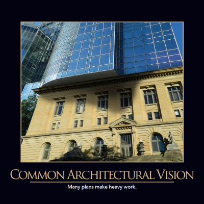

Well-designed software must have a single, well-defined architecture. Virtually all software, regardless of how well-designed one might find it, starts out with a single architecture. Unfortunately, many applications evolve over time, sometimes going through a partial re-architecting process that never completes. When this happens, the software becomes a kind of Frankenstein monster, with some portions built on one architecture, and some on another. Of course, architectural changes are often made for good reasons, so the solution is not to simply stick with whatever the original application used. Rather, it's important to build software such that future changes in architecture can be accomplished without an insurmountable amount of effort, and ideally such changes should be completed rather than abandoned part-way through the process.

The more modular the application, the better able it is to adopt new architectural patterns. A single monolithic application, with no modularity, must make an all-or-nothing approach to its architecture. Or worse, its architecture can be updated while it continues to run, resulting in the Frankenstein monster described above. Applications that are more modular can adjust their architecture to suit individual modules, or can be upgraded over time, one module at a time. A micro-services style architecture is one in which many small, self-contained components communicate with one another over HTTP (typically). Over time, if individual services would benefit from a change in architecture, they can evolve independently of other services. Likewise, if the whole system's architecture must be updated, individual services can be updated and deployed one-by-one, without the need to try to take on upgrading the entire application all at once.

Micro-services aren't the only designs that can more easily be updated. Any application that follows [separation of concerns](/principles/separation-of-concerns) and other software design principles will be easier to update and maintain than a system that is full of [spaghetti code](/antipatterns/spaghetti-code).

## References

[Free ASP.NET Core Architecture eBook](http://ardalis.com/architecture-ebook)
