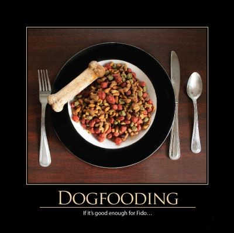

_Dogfooding_ is short for "Eating your own dog food," which represents the practice of using your own products.  For software developers, that means working with, as a real user, the applications you're building, or at least working closely with people who do use it.  Dogfooding provides a number of advantages, both marketing and technical.

From a marketing perspective, naturally it looks better for you and your organization to use your own tools over those of a competitor.  At a minimum, it avoids some of the embarassment in the public eye when employees of company A are found to be users of competing company B.  Beyond merely avoiding being seen using competing products, actual dogfooding should include early and heavy adoption of a company's products, pushing the envelope in order to provide valuable product feedback and demonstrate to the market the product's capabilities.  Many companies provide early access to the latest stable builds of their software, or to early prototypes of their hardware, to their employees for just this reason.

In addition to the marketing benefits of dogfooding, software developers who use their own software are forced to see firsthand what the user experience of their application is like.  Frequently, this is an eye-opening experience the first time it happens, with the developer wondering "why does the software work like this if you're trying to do that?"  In [The Inmates Are Running the Asylum](http://amzn.to/X09Jp8), Alan Cooper writes about the issues that arise when the technologists who make the decisions about how technical products are created are out of touch with the end users of these products.

Using your own software, alone and with other end users, turns out to be a great way to determine not only if you're building the thing right, but also whether you're building the right thing.  Dogfooding today is a form of alpha testing, and it's common not only to allow users to install their own recent builds of software, but also to configure shared applications like social media and banking web sites so that the experience for employees' accounts is different from the general public, and includes the latest proposed updates to the system.

The origin of the term stems from Microsoft, who referred to 1970s television advertisements for Alpo dog food, in which the actor endorsed the product by claiming he fed Alpo to his own dogs.  In 1988, a Microsoft manager challenged another manager to increase internal usage of the company's product, in an email titled "Eating our own Dogfood." ([source](http://en.wikipedia.org/wiki/Eat_one%27s_own_dog_food))

One benefit of proper dogfooding is, if you intend to expose your internal APIs publicly, they will actually be usable.  At Amazon, Jeff Bezos famously issued a mandate around 2002 requiring all teams to expose their data and functionality via service interfaces, and for all teams to communicate with each other through these interfaces.  Direct linking, direct access to databases, and other back doors were prohibited.  All of these service interfaces also needed to be designed from the ground up to be exposed to the world.  The mandate ended with _**"Anyone who doesn't do this will be fired.  Thank you; have a nice day!"**_ The end result?  Amazon Web Services are a massive commercial success, and an online bookstore is now an industry leader in cloud computing. ([source](http://apievangelist.com/2012/01/12/the-secret-to-amazons-success-internal-apis/))

## References

[The Inmates Are Running the Asylum](http://amzn.to/X09Jp8) on Amazon

2013 Software Craftsmanship Calendar (from which the image was taken)

[The Secret to Amazon's Success: Internal APIs](http://apievangelist.com/2012/01/12/the-secret-to-amazons-success-internal-apis/)

[Dogfooding: how to build a great API](http://richarddingwall.name/2012/08/15/dogfooding-how-to-build-a-great-api/)
