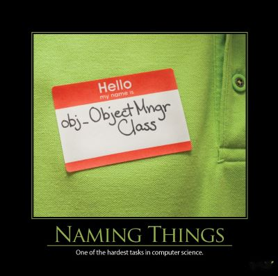

It is hard to overestimate the importance of choosing good names for source code elements in software development.  Much has been written on this topic, and it is often a source of great debate.  "What makes a name good, or better than another?"  "What about my favorite cryptic notation that I've been using since last century?"  "Everybody should always use my favorite prefixes/suffixes everywhere!"  The topic of naming things can frequently degrade into such discussions, but here we will discuss some principles that should inform your decisions when naming things that are generally accepted today by professional software developers.

The first principle of Naming Things is to be consistent within your team or project.  It doesn't matter what your personal preference might be, it's more important that the code everybody is sharing uses consistent names.  There are other guidelines and recommendations below, but none of them trump this one.

Names are one of the most powerful tools you have for communicating your code's intent to those who read your code (including yourself, in the future).  It's critically important to choose meaningful names.  It's also important that the names you choose make sense not just to you, but to others involved on the project - your team.  One way to dramatically improve the consistency and quality of your names is to [pair with another developer on your team](/practices/pair-programming), since whatever names the two of you come up with that make sense to both of you are now very likely to be accepted and understood by the other members of the [whole team](/practices/whole-team).  Having two developers involved in creating new code constructs also makes it more likely the code will follow the project's naming conventions, assuming these aren't already being enforced by a tool (like [StyleCop](http://stylecop.codeplex.com/) or [ReSharper](http://www.jetbrains.com/resharper/)).

Names should describe why a programming element exists, what its purpose is. If a name is so short that a comment is necessary to state its actual purpose, then it is too short.  For instance, in Clean Code, Tim Ottinger notes that:

```java
int d; // elapsed time in days
```

is an example of a poor name.  Instead, consider names like these:

```java
int elapsedTimeInDays;
int daysSinceCreation;
```

Note here that the units are included in the variable name.  Consider the .NET Framework's [Thread.Sleep method](http://msdn.microsoft.com/en-us/library/d00bd51t(v=vs.110).aspx), which takes an Int32.  There is no ambiguity about the units of this value, since it is named _millisecondsTimeout_.

[How To Write Unmaintainable Code](https://github.com/Droogans/unmaintainable-code) has a whole section dedicated to naming.  Some examples include:

- Use random baby names (e.g. Fred) for all variable names
- Only use single character variable names.  Especially l, since it can be mistaken for 1.
- Vary similar variable names by mis-spelling (or using correct, alternate spellings) e.g. color, colour
- Use a thesaurus and alternate how similar operations are named wherever possible (e.g. show, display, present)
- Randomly capitalize syllables withIn words
- Reuse names within different scopes
- Be as terse as possible.  Consider omitting all vowels from your variable names
- Use Hungarian Notation

Some other bad examples:

- Name all boolean variables negatively (e.g. notReady, InValid, IsNotGood)
- Name all boolean variables _flag_
- Name classes that do various things _Util_, _Utils_, _Manager_, _Helper_, etc.

A few good qualities for your names to have are:

- Pronounceable
- Searchable
- Do not contain encoded information (e.g. the type) in strongly typed languages
- Are at the appropriate level of abstraction
- Use longer names to describe longer scoped variables
- Name classes for how they are implemented
- Name methods for what they do, including side effects
- Use consistent names from the application's model / domain language / ubiquitous language
- Avoid mixing opposites - be consistent (don't use begin/end in one place, start/finish in another, etc.)
- Avoid numbers (e.g. item1, item2, item3)

Make the names of methods and classes as long as necessary to accurately describe what they do.  If the resulting name is too long, it's a good indicator (or [code smell](/antipatterns/code-smells/)) that the construct in question is probably trying to do too much, and should be broken up into several more cohesive parts.

## Quotes

"There are only two hard things in Computer Science: cache invalidation and naming things." - Phil Karlton

## References

[Naming is Everything](http://jasonroelofs.com/2012/10/01/naming-is-everything/)

[Two Hard Things](http://martinfowler.com/bliki/TwoHardThings.html) by Martin Fowler

[How To Write Unmaintainable Code](https://github.com/Droogans/unmaintainable-code)

[Name Smells](http://www.daedtech.com/name-smells)

[.NET Guidelines for Names](http://msdn.microsoft.com/en-us/library/vstudio/ms229002(v=vs.100).aspx)

2013 Software Craftsmanship Wall Calendar

[Clean Code](http://amzn.to/YjUDI0) by Robert C. Martin

[Code Complete](http://amzn.to/Vq5YLv) by Steve McConnell
