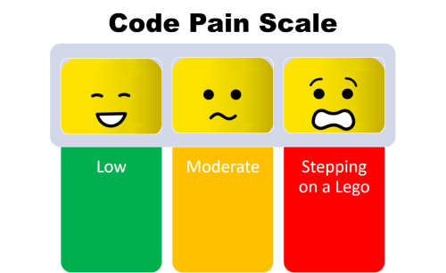

What is Pain Driven Development (PDD)? It means waiting to apply [principles](/category/principles/), [patterns](/category/patterns/), and [practices](/category/practices/) to your code until there is some pain the current approach is causing that must be addressed. It's a variation of [YAGNI](/yagni/) that ensures you are not blindly gold-plating the codebase without adding value to the customer.

A great example of when to apply PDD is with the [Open-Closed Principle](/open-closed-principle/). No software can be open to extension, but closed to modification in every possible way. If it were, it would be too abstract to be useful - like shipping an IDE to your customer so they can build whatever they want, instead of shipping them the actual software they've asked for. With OCP, the recommended approach is to let the first change or two require modification. Write a conditional statement to account for the new behavior. Do the simplest thing that lets the software accommodate the new requirement. Only after this has happened again and again, and it's pretty clear it's going to continue to evolve in this fashion, does it make sense to apply OCP to guard against the specific kinds of changes you're seeing the code require based on actual customer demands.

Some kinds of pain may make sense to avoid altogether. This includes pain that will be very difficult to alleviate in the future, such as from improperly setting up your project dependency structure early on in a project. In these cases, let your experience guide you. If you know that you are going to want to be able to decouple your UI layer from your Data layer, for instance, because you've experienced the pain of tight coupling enough times in the past, it's not a violation of [YAGNI](http://deviq.com/yagni/) to start out with a loosely coupled project organization, such as a [domain-centric n-tier design](http://www.pluralsight.com/courses/n-tier-apps-part1).

## Quotes

<blockquote class="twitter-tweet" lang="en">pain driven development, yagni's ugly, meaner stepsister. works great until you let go just once, then it's uphill.

— Matt Hinze (@mhinze) <a href="https://twitter.com/mhinze/status/969891604">October 22, 2008</a></blockquote>

<blockquote class="twitter-tweet" lang="en">Pain-Driven Development - if it doesn’t hurt, it doesn’t need fixing. If it hurts, fix it! http://bit.ly/bLs111

— Schrodinger's Code (@SchrodingerCode) <a href="https://twitter.com/SchrodingerCode/status/10551079676">March 16, 2010</a></blockquote>

