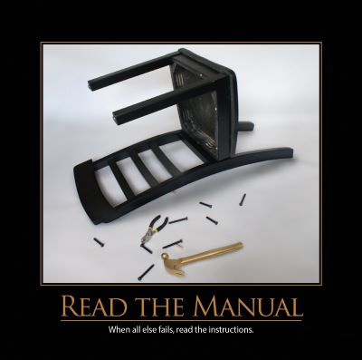

A great deal of the time, software developers can mostly figure things out by just trying things, and seeing what fits.  Maybe it's a matter of trying different combinations until the compile error disappears, or maybe it's a matter of searching online until a snippet looks like it might work.  In any case, although trial-and-error can certainly produce working software (and some great stories and some knowledge), sometimes actually reading the documentation, manual, or instructions is warranted.

## Quotes

When all else fails, read the instructions.

## References

[RTFM](http://en.wikipedia.org/wiki/RTFM) on Wikipedia

2013 Software Craftsmanship Wall Calendar
